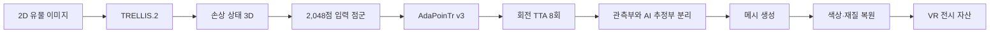
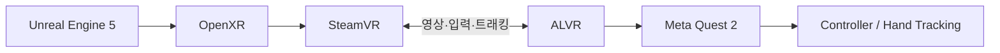

# BONDI


> 손상된 유물을 3D로 생성하고 결손 형상과 표면을 복원한 뒤, 실제 크기의 VR 박물관에서 관람하는 체험형 프로젝트입니다.

[핵심 기능](#핵심-기능) · [AI 복원](#ai-복원-파이프라인) · [VR 전시](#vr-전시) · [검증](#구현-결과와-검증-범위) · [문서](#문서)

| 항목 | 내용 |
| --- | --- |
| 프로젝트 | BONDI · AI 유물 복원 VR 박물관 |
| 기간 / 인원 | 2026.08–09 · 4주 · 7명 |
| 대상 기기 | Meta Quest 2 · PC VR 스트리밍 |
| 핵심 기술 | TRELLIS.2, AdaPoinTr, Blender, Unreal Engine 5, OpenXR, SteamVR, ALVR |
| 프로젝트 키 | `S15P21C201` |

`본디`는 “본래의 모양이나 처지”라는 뜻입니다. BONDI는 훼손된 유물을 역사적 정답으로 단정하지 않고, 사진과 3D 데이터에서 만든 **AI 복원 가설**을 관람자가 직접 비교하고 체험할 수 있게 합니다.

## 문제와 접근

같은 유물의 손상 상태와 완형 상태를 함께 담은 3D 학습 쌍은 거의 없습니다. BONDI는 완형 유물 3D를 확보한 뒤 여러 결손 패턴을 합성해 학습 쌍을 만들고, 점군 완성 모델이 결손부를 추정하도록 구성했습니다.

```text
2D 유물 이미지
  → TRELLIS.2 손상 상태 3D 생성
  → 점군 변환
  → AdaPoinTr 형상 복원
  → 관측부와 AI 추정부를 분리한 메시 생성
  → 색상·재질 복원
  → Unreal Engine VR 박물관 전시
```

전문 문화재 복원을 대신하는 서비스가 아니라, 유물의 크기와 형태를 여러 각도에서 살펴보고 복원 전후를 비교하는 체험형 콘텐츠를 목표로 했습니다.

## 핵심 기능

### 1. 사진 기반 3D 유물 생성

- 단일 2D 유물 이미지를 TRELLIS.2에 입력해 형상과 재질을 가진 손상 상태 3D를 생성합니다.
- TripoSR, SPAR3D, PartCrafter 등 후보 모델을 같은 입력으로 비교했습니다.
- 생성 결과는 실제 치수가 아니므로 메타데이터와 기준 치수를 이용해 전시 크기를 보정합니다.

### 2. AdaPoinTr 기반 결손 형상 복원

- 손상 메시를 2,048점 입력 점군으로 변환하고 AdaPoinTr가 8,192점의 완성 형상을 추정합니다.
- 축 둘레로 45도씩 회전하는 TTA 8회를 적용해 최대 65,536점의 후보를 얻습니다.
- `(높이, 각도)` 격자에서 AI 점을 우선 사용하고, 비어 있는 영역은 회전대칭 대조군으로 보완합니다.
- 관측부 메시와 AI 생성 면을 별도 노드로 내보내 복원 근거를 구분합니다.

### 3. 표면과 재질 복원

- 점군을 메시로 재구성한 뒤 원본 사진과 TRELLIS.2 결과를 이용해 색과 재질을 입힙니다.
- CIE Lab 색 분포, 곡률, 손상 마스크를 이용해 남아 있는 표면은 보호하고 손상부만 보정합니다.
- 회전체 복원, SAM 기반 마스크, 수동 UV 브러시를 보조 경로로 사용합니다.

### 4. VR 박물관 체험

- Unreal Engine 5와 OpenXR로 박물관 공간, 포털 이동, 유물 전시를 구현했습니다.
- Quest 2는 SteamVR과 ALVR을 통해 PC VR 콘텐츠를 무선으로 실행합니다.
- 컨트롤러와 손 추적으로 유물을 잡고 회전한 뒤 원래 위치로 돌려놓을 수 있습니다.
- 복원 단계 전환과 근접 정보 패널로 손상 상태와 복원 상태를 비교합니다.

### 5. 유물 자료 저장소

- FastAPI, SQLite, Three.js로 팀 내부 3D 자료를 검색하고 미리 보는 웹 도구를 만들었습니다.
- GLB 썸네일과 방향을 검사하고, Jenkins로 서버 배포를 자동화했습니다.
- 원본 3D 자료와 모델 가중치는 Git에 넣지 않고 별도 저장소에서 관리합니다.

## AI 복원 파이프라인




형상 복원은 세 방법을 같은 유물에서 비교했습니다.

| 방법 | 역할 | 현재 상태 |
| --- | --- | --- |
| AdaPoinTr 점군 완성 | 회전대칭을 직접 가정하지 않는 학습 기반 복원 | 현행 경로 · v3 가중치 · v22 메시 |
| 회전대칭 + 이중조화 | 근거를 열거할 수 있는 기하 복원 | 대조군과 빈 영역 보완 |
| PCA 형상 사전 | 프로파일 대부분이 사라진 유물을 위한 통계 모델 | 현 대상에는 불필요해 보류 |

상세한 설계와 코드는 [AI 복원 문서](docs/AI_RESTORATION.md)와 [`ai/3d-to-3d-shape/`](ai/3d-to-3d-shape/)에서 확인할 수 있습니다.

## VR 전시

<p align="center">
  
  
  
</p>



VR 구현과 성능 조정 내용은 [VR 체험 문서](docs/VR_EXPERIENCE.md)에 정리했습니다.

## 구현 결과와 검증 범위

발표 자료와 최종 저장소는 서로 다른 개발 시점을 기록합니다. 발표 당시 16개 완형에 결손 패턴 6종과 변형 20회를 적용해 1,920쌍을 만들었고, 이후 저장소에서는 누출을 막는 형상 단위 분할과 독립 테스트 세트를 추가해 19개 형상·2,280쌍으로 확장했습니다.

| 항목 | 결과 | 해석 범위 |
| --- | --- | --- |
| 발표 시점 학습 데이터 | 16 × 6 × 20 = 1,920쌍 | 발표 당시 파인튜닝 데이터 |
| 최종 데이터 분할 | train 14형상·1,680쌍 / val 2형상·240쌍 / test 3형상·360쌍 | 같은 유물이 학습과 평가에 섞이지 않게 분할 |
| 회전 TTA | 결손 후보 영역 커버리지 5.2% → 28.0% | 예측 점이 놓인 결손 후보 격자의 비율 |
| 깊은 결손의 F순증 | 사전학습 0.026 → v3 0.918 | 결손률 0.50–0.65인 최종 테스트 구간 |
| provenance 분리 | 관측부 V=94,877 / F=149,150 무수정 | AI가 만든 면을 별도 노드로 저장 |

완료한 범위:

- 사진에서 손상 상태 3D를 만드는 경로
- 합성 결손 학습 데이터 생성과 AdaPoinTr 파인튜닝
- 회전 TTA, 점군 필터링, 메시화와 재질 복원
- 관측부와 AI 추정부 분리
- Quest 2 기반 PC VR 박물관과 유물 인터랙션
- 내부 유물 자료 저장소와 자동 배포

남아 있는 한계:

- AI가 만든 완형 데이터 자체에 단일 이미지 생성 모델의 추정이 포함됩니다.
- TTA 이후에도 결손 후보 격자의 72%에는 직접 예측점이 없습니다.
- 회전대칭 보완은 회전체 유물에 강하게 의존합니다.
- 실제 문화재 복원 판단에는 전문가 검토와 추가 근거가 필요합니다.
- 모델 가중치와 원본 데이터는 저장소에 포함하지 않아 별도 준비가 필요합니다.

평가 정의와 실패 사례는 [검증 문서](docs/VALIDATION.md)에 따로 기록했습니다.

## 현은빈의 구현

- AdaPoinTr 기반 3D 유물 점군 완성 경로와 회전 TTA를 구현했습니다.
- 완형 유물에서 6종 결손과 변형을 합성하고, 형상 단위 train/val/test 분할을 구성했습니다.
- 정규화 좌표에서 원래 크기를 읽는 벤치마크 누출을 찾아 평가 경로를 수정했습니다.
- Chamfer Distance 대신 결손부 커버리지를 함께 사용해 체크포인트를 선택했습니다.
- 관측부 메시를 유지하면서 AI 생성 면만 별도 노드로 만드는 메시화 방식을 구현했습니다.
- 회전대칭 복원과 PCA 형상 사전을 대조 경로로 실험하고 적용 조건을 정리했습니다.

초기 연구 과정은 `Study` 브랜치의 [`현은빈/`](https://github.com/eunbin-hyun/BONDI/tree/Study/%ED%98%84%EC%9D%80%EB%B9%88)에 보존하고, 최종 구현의 기준은 `master`의 코드와 문서로 구분합니다.

## 팀

| 구성원 | 최종 발표 역할 | 주요 작업 영역 |
| --- | --- | --- |
| 공세민 | VR 디자인 | 박물관 전시 구성과 VR 디자인 |
| 김소영 | VR 최적화 | Quest 2 포팅, 렌더링·프레임 최적화 |
| 김신정 | VR 이동 | 이동과 VR 입력·인터랙션 |
| 김채원 | 이미지 복원 | 색상·재질 복원과 이미지 기반 처리 |
| 장서진 | 공간 복원 | Matrix-3D·DEM·Blender MCP 기반 공간 구성 |
| 현은빈 | 유물 복원 | AdaPoinTr 형상 복원, 메시화, provenance 분리 |
| 권영호 | Infra | 유물 자료 저장소, 서버, CI/CD |

## 저장소 구조

```text
BONDI/
├── ai/       2D→3D 생성, 형상·색·재질 복원, 검증 코드
├── assets/   전시용 유물 자산 번들
├── vr/       Unreal Engine 5 VR 프로젝트
├── infra/    유물 자료 저장소와 배포 구성
├── tools/    Blender·Unreal·자산 검사 도구
├── docs/     최종 아키텍처, 실행, 검증 문서와 과거 기획 기록
└── Study     팀원별 연구 기록을 보존하는 별도 브랜치
```

## 실행

이 저장소는 AI, VR, 자료 서버가 서로 다른 실행 환경을 사용합니다. 전체를 한 명령으로 설치하는 형태가 아니며, 필요한 구성요소의 원본 데이터와 가중치를 별도로 준비해야 합니다.

```bash
git lfs install
git clone https://github.com/eunbin-hyun/BONDI.git
cd BONDI
```

구성요소별 요구사항과 실행 순서는 [SETUP.md](docs/SETUP.md)를 참고하세요.

## 문서

- [문서 인덱스](docs/README.md)
- [시스템 아키텍처](docs/ARCHITECTURE.md)
- [AI 형상·색·질감 복원](docs/AI_RESTORATION.md)
- [VR 박물관 구성과 인터랙션](docs/VR_EXPERIENCE.md)
- [평가 방법, 결과와 한계](docs/VALIDATION.md)
- [실행 환경과 시작 방법](docs/SETUP.md)
- [주요 설계 결정 기록](docs/DECISIONS.md)

## License

이 저장소에는 별도의 오픈소스 라이선스가 지정되어 있지 않습니다. 코드와 에셋의 재사용·재배포 권한은 명시적으로 부여되지 않습니다. 외부 데이터와 모델은 각 원저작자와 배포처의 라이선스를 따릅니다.
