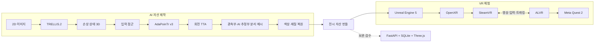
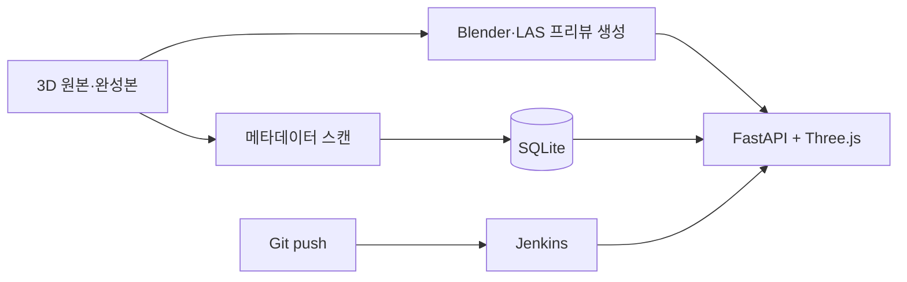

# BONDI 시스템 아키텍처

## 전체 구성

BONDI는 하나의 런타임 서비스가 아니라 세 개의 제작·체험 경로로 구성됩니다.

1. AI 제작 파이프라인이 사진과 3D 자료에서 전시 자산을 만듭니다.
2. Unreal Engine 프로젝트가 완성된 자산을 VR 박물관에 배치합니다.
3. 내부 자료 저장소가 팀의 원본·중간·완성 자산을 검색하고 검수하게 합니다.



## AI 계층

| 단계 | 입력 | 처리 | 출력 |
| --- | --- | --- | --- |
| 2D→3D | 단일 유물 사진 | TRELLIS.2 형상·재질 생성 | 손상 상태 GLB |
| 점군 완성 | 2,048점 부분 점군 | AdaPoinTr v3, 회전 TTA 8회 | 완성 후보 점군 |
| 메시화 | 원본 메시 + 완성 후보 | `(h, θ)` 격자, 밀도 필터, 회전대칭 보완 | 관측부와 AI 추정부를 나눈 메시 |
| 표면 복원 | 메시, 사진, 텍스처 | 색 분포, 곡률, 손상 마스크, 재질 규칙 | VR용 GLB·텍스처 |

형상 복원 코드는 [`ai/3d-to-3d-shape/`](../ai/3d-to-3d-shape/), 표면 복원 코드는 [`ai/3d-to-3d-color/`](../ai/3d-to-3d-color/)에 있습니다.

## 자산 계약

전시 자산은 `assets/<artifact-id>/`에서 원본과 런타임 결과를 분리합니다.

```text
assets/<artifact-id>/
├── source/     원본 또는 다시 임포트할 자료
├── master/     손상·모델 복원·최종 복원 단계
└── runtime/    Unreal Engine이나 뷰어가 바로 쓰는 결과
```

모델 가중치, 원본 데이터셋, 대규모 중간 산출물은 Git에 포함하지 않습니다. 코드, 설정, 메타데이터, 비교 그림만 저장소에서 관리합니다.

## VR 계층

| 구성 | 역할 |
| --- | --- |
| Unreal Engine 5 | 박물관 공간, 전시, 포털, UI, 인터랙션 |
| OpenXR | 기기 독립 입력과 트래킹 |
| SteamVR | PC VR 런타임 |
| ALVR | PC 렌더링 화면과 Quest 2 입력의 무선 전송 |
| Meta Quest 2 | 최종 체험 기기 |

시작 맵은 `/Game/XRFramework/Levels/L_Museum`, 기본 Pawn은 `BP_XRPawn`입니다. 유물 액터는 `Artifact` 태그와 `BP_GrabComponent`를 이용해 잡기 대상으로 등록합니다.

## 내부 자료 저장소

`infra/web/`은 최종 VR 앱과 분리된 팀 내부 도구입니다.



서버 주소, DB, 원본 자산과 프리뷰는 저장소에 커밋하지 않습니다.

## 핵심 설계 판단

### 형상 단위 데이터 분할

같은 완형에서 만든 결손 쌍이 학습과 평가에 동시에 들어가면 모델이 형상을 기억할 수 있습니다. train, validation, test를 쌍이 아니라 원본 형상 단위로 나눴습니다.

### 관측부 보존

전체 점군을 푸아송 재구성하면 원래 관측한 면과 AI가 만든 면이 하나로 섞입니다. BONDI는 원본 메시를 유지하고 결손부에서 만든 면만 별도 노드로 저장합니다.

### VR에서 추론하지 않음

AI 추론과 자산 제작은 오프라인에서 끝냅니다. 헤드셋은 검수된 전시 자산만 렌더링해 프레임 안정성과 재현성을 확보합니다.

### 코드와 대용량 산출물 분리

재현에 필요한 스크립트와 기록은 Git에 보관하고, 가중치·원본·중간 결과는 공유 스토리지에서 관리합니다. 이 경계는 [SETUP.md](SETUP.md)에 정리했습니다.
