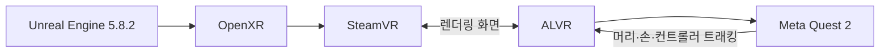

# VR 박물관 구성과 인터랙션

## 체험 목표

관람자는 유물을 실제 크기로 마주하고, 전시장에서 보기 어려운 바닥과 뒷면까지 살펴볼 수 있습니다. 손상 상태와 AI 복원 상태를 전환해 추정된 부분을 비교합니다.

## 실행 구성

| 항목 | 값 |
| --- | --- |
| 프로젝트 | `vr/testproj/testproj.uproject` |
| 시작 맵 | `/Game/XRFramework/Levels/L_Museum` |
| 게임 모드 | `BP_XRGameMode` |
| Pawn | `BP_XRPawn` |
| 입력 | 컨트롤러 기본, 손 추적 지원 |
| 실행 | Quest 2 + ALVR + SteamVR |

## 관람 흐름

1. 메인 홀에서 프로젝트와 AI 복원 기준을 확인합니다.
2. 포털을 통해 유물별 전시 공간으로 이동합니다.
3. 유물에 가까이 가면 정보 패널이 나타납니다.
4. 컨트롤러 또는 손으로 유물을 잡고 회전합니다.
5. 버튼으로 손상 상태와 복원 상태를 비교합니다.
6. 유물을 놓거나 복귀 동작을 수행하면 원래 전시 위치로 돌아갑니다.

## 주요 인터랙션

### 잡기와 회전

`Artifact` 태그와 `BP_GrabComponent`를 가진 액터만 집을 수 있습니다. 잡은 동안 유물 충돌이 플레이어를 밀어내지 않도록 대상별 충돌과 복귀 규칙을 조정했습니다.

### 복원 단계 전환

`BP_StageToggle`이 손상 메시와 복원 메시를 교체합니다. 메시마다 단위와 축이 달라 메시, 스케일, 회전 값을 한 묶음으로 관리합니다.

### 근접 정보 패널

유물별 `WidgetComponent`가 관람 거리에서만 나타납니다. 고정 텍스트를 매 프레임 다시 그리지 않도록 `RedrawTime`을 조정했습니다.

### 포털과 공간

메인 홀과 테마 공간을 포털로 연결했습니다. 포털 이동 시 머리 방향과 플레이 공간 원점을 보정해 예상한 위치와 방향으로 도착하게 합니다.

## 성능 개선

실기에서 비용이 컸던 부분을 다음과 같이 줄였습니다.

- 고정 안내 패널의 렌더 타깃 갱신 빈도를 낮췄습니다.
- 유물별 복귀 검사를 25회에서 5회로 줄였습니다.
- B·C방 광원을 Static과 Stationary로 분리하고 Movable 광원을 줄였습니다.
- 37만 삼각형 유물에 30%, 10%, 3% LOD를 추가했습니다.
- 사용하지 않는 스펙테이터 SceneCapture를 제거했습니다.
- Forward Shading, Instanced Stereo, Mobile Multi-View, MSAA 경로를 사용하고 Lumen과 Ray Tracing을 끕니다.

에디터 VR Preview와 ALVR 스트리밍에는 에디터·인코딩 비용이 함께 들어갑니다. 최종 성능 판단은 패키징 빌드에서 해야 합니다.

## 공간 복원 콘텐츠

인왕제색도 공간은 Matrix-3D와 DEM을 병렬로 사용해 지형 근거를 보완했습니다. 수묵화의 공간감은 Blender MCP로 조정하고, 집과 나무 등 그림 요소는 TRELLIS.2로 3D 에셋화했습니다.

고운사 연수전 콘텐츠는 화재 전 기록과 현재 상태를 함께 보여 주는 별도 전시 자산으로 구성했습니다.

## 알려진 제약

- Quest 2의 PC VR 스트리밍 품질은 무선망과 인코딩 설정에 영향을 받습니다.
- 일부 전시 자산은 Git LFS 또는 외부 저장소가 없으면 다시 임포트할 수 없습니다.
- 임베드된 맑은 고딕 자산은 외부 공개 배포 전에 OFL 폰트로 교체해야 합니다.
- C방 상시 로드와 고폴리곤 유물은 추가 최적화 대상입니다.

상세한 프로젝트 기록은 [`vr/testproj/README.md`](../vr/testproj/README.md), 연결 설정은 [`vr-streaming-setup.md`](vr-streaming-setup.md)를 참고합니다.
