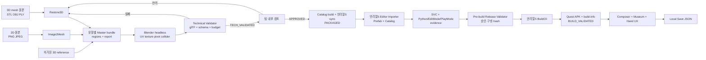

# 문화유산 디지털 복원·개인형 VR 박물관 종합 명세서

| 항목 | 내용 |
| --- | --- |
| 문서 ID | MASTER-C201-001 |
| 버전 | 1.0 |
| 기준일 | 2026-08-31 |
| 기간/인원 | 5주 / 7명 |
| 대상 플랫폼 | 오큘러스2 * 3/피코4 * 2 |
| 문서 성격 | 7명이 동일한 내용으로 프로젝트를 진행할 수 있게 도와주는 명세서. |

## 0. 문서 사용 규칙

- MUST는 최종 릴리스 필수다. 하나라도 미충족이면 범위를 축소하거나 No-Go로 판정한다.
- SHOULD는 모든 MUST와 관련 성능 gate를 통과한 뒤 구현한다.
- MAY는 일정 여유가 있을 때만 구현한다.
- 요구사항 ID와 인수시험 ID는 재번호화하지 않는다.
- 수치·실패 조건·승인 상태·데이터 계약은 설명보다 우선한다.
- AI 출력은 역사적 정답이 아니라 검증 가능한 전시용 복원·생성 가설이다.
- 외부 문화유산 전문가가 실제 검토하지 않았다면 domainReview는 null이며 전문가 검증으로 표현하지 않는다.
- 구현 변경이 요구사항·자산 digest·XR stack·빌드 계약에 영향을 주면 ADR과 문서 버전을 함께 갱신한다.

## 문서 구성

1부: 프로젝트 기획 — 목표, 범위, 사용자, 7인 역할, 5주 일정, 위험과 Go/No-Go
2부: 요구사항·수용시험 — 입력·출력, 요구사항, 상태 모델, 시험, 완료 정의
3부: 구현 핵심 — 아키텍처, 기술 스택, artifact 계약, AI·Blender·언리얼5·XR·시험
4부: 통합 빌드·릴리스 규칙 — 증거 묶음, 빌드 순서, 변경 관리

---

## 1부. 프로젝트 기획

### 1. 문서 목적

이 문서는 5주 안에 실제 시연 가능한 제품 범위, 사용자 가치, 팀 역할, 일정, 완료 조건과 위험 대응 원칙을 확정한다. 요구사항의 세부 수용 기준은 본 문서 2부, 기술 선택과 모듈별 구현 방식은 본 문서 3부를 따른다.

### 2. 현재 상태와 전제

AI 문화유산 복원 사례와 한계를 다룬다. 다음 원칙을 제품의 필수 정책으로 채택한다.

1. AI 출력은 역사적 정답이 아니라 **전시용 디지털 복원 가설**이다.
2. 원본 관측, 기하 보간, AI 생성, 사람 제작·수정 영역을 실제 존재하는 경우에만 별도 region class로 분리한다. 사람이 수정했다고 해서 문화유산 전문가 검증으로 간주하지 않는다.
3. 원본 파일은 덮어쓰지 않으며 해시, 단위, 좌표 변환, 모델·코드 버전, seed와 파라미터를 기록한다.
4. 사람이 검토·승인하기 전에는 VR 전시 카탈로그에 넣지 않는다.
5. 전시용 경량 모델과 학술·보존용 원본/계측 모델을 분리한다.

#### 2.3 5주 MVP에서 내린 결정

| 결정 | 확정 내용 | 이유 |
| --- | --- | --- |
| 복원 대상 | 우선 `ssu022891-001-30000_Step3.stl` 축대칭 토기 1점; 회수·허가 실패 시 허가된 토기 mesh의 synthetic damage 사례 1점. 두 번째 사례는 목표 범위 | 현재 저장소에 실행 코드·원본이 없으므로 검증 가능한 최소선을 보수적으로 확정 |
| 일반 3D 메시 | 작은 스캔 구멍의 기계적 보정만 허용 | 임의 형상의 소실부를 역사적으로 복원할 근거가 없음 |
| 2D→3D 대상 | 배경이 단순한 단일 휴대형 유물 이미지 | 건축물·대규모 유적은 별도 파이프라인이 필요 |
| AI 실행 위치 | 제작 PC의 오프라인 파이프라인 | Quest에서 생성 모델을 실시간 실행하지 않음 |
| VR 콘텐츠 | 검수·최적화된 GLB를 언리얼5 빌드 시 포함 | 5주 내 안정성과 72 Hz 성능 확보 |
| 박물관 편집 | 1개 공간 템플릿, 3개 고정 슬롯 | 벽·바닥을 만드는 자유형 에디터는 제외 |
| 개인화 | 카탈로그 5점 이상 중 3점 선택, 슬롯·회전 저장 | 계정·서버 없이도 “나만의 박물관” 경험 제공 |
| 네트워크 | 앱 실행에는 불필요 | 시연장 네트워크 리스크 제거 |
| 입력 방식 | 손 추적 우선, 컨트롤러 대체 입력 제공 | 핵심 목표와 시연 안정성 동시 확보 |

### 3. 제품 정의

#### 3.1 한 문장 정의

> 관측 데이터와 AI 추정 영역을 구분해 만든 문화유산 디지털 복원 후보를 사용자가 직접 선택·배치하고, VR에서 맨손으로 비교·관찰하는 추적 가능한 개인 박물관 MVP.

#### 3.2 해결하려는 문제

- 훼손·소실된 문화유산을 평면 이미지나 완성 모델 하나로만 보여 주면 관람객은 무엇이 실제 관측이고 무엇이 추정인지 알기 어렵다.
- 3D·AI 처리 결과와 VR 전시 자산 사이에 공통 포맷과 품질 기준이 없으면 통합 단계에서 크기, 축, 재질, 성능 문제가 발생한다.
- 일반적인 디지털 전시는 수동 관람에 머물러 관람객이 유물을 가까이 보고 돌려 보며 복원 근거를 비교하기 어렵다.

#### 3.3 핵심 가치

1. **투명성**: 원본과 생성 영역을 분리하고 근거·한계를 함께 보여 준다.
2. **몰입성**: 사용자가 원하는 유물을 선택해 자신만의 전시를 만든다.
3. **직관성**: 손으로 잡고 회전하며 원본/복원 상태를 비교한다.
4. **재현성**: 동일 입력과 설정으로 AI 산출물과 품질 보고서를 다시 만들 수 있다.

### 4. 목표 사용자와 사용 시나리오

| 사용자 | 주요 목적 | MVP에서 제공할 경험 |
| --- | --- | --- |
| 관람객 | 유물을 능동적으로 관찰하고 복원 과정을 이해 | 유물 선택, 슬롯 배치, 텔레포트, 손으로 잡기·회전, 원본/복원 비교, 설명 확인 |
| 큐레이터/연구자 | AI 결과를 검토하고 근거와 함께 전시에 반영 | 오프라인 파이프라인 실행, 보고서 확인, 승인된 자산만 카탈로그 등록 |
| 시연 운영자 | 같은 데모를 반복해서 안정적으로 실행 | 오프라인 APK, 초기화, 컨트롤러 fallback, 진단 화면과 백업 영상 |

#### 4.1 큐레이터 제작 흐름

```text
승인된 원본 수집
→ 원본 해시·단위·출처 등록
→ 3D 복원 또는 2D→3D 실행
→ Blender 경량화·재질 처리(여기서 MCP로 복원 추가로 해도 될듯?)
→ 자동 schema·메시·품질·자산 예산 검사
→ 사람이 원본·생성 영역·출처·한계 검토 및 승인
→ 승인 자산으로 immutable 카탈로그 생성
→ 언리얼5 동기화·import·자동 시험·pre-build 검증
→ APK 빌드·실제 검증
```

#### 4.2 관람객 체험 흐름

```text
앱 시작
→ 카탈로그 5점 이상 중 3점 선택
→ 세 전시 슬롯에 배치
→ VR 박물관 입장
→ 텔레포트로 이동
→ 유물을 잡아 회전·관찰
→ 원본/복원·추정 영역 비교
→ 설명·출처·한계 확인
→ 배치 저장 후 재방문
```

### 5. 제품 범위

#### 5.1 Must — 최종 시연 전 반드시 완료

| ID | 범위 |
| --- | --- |
| M-01 | 토기 복원 사례 1점을 원본 입력부터 GLB·보고서까지 다른 팀원이 재실행 가능 |
| M-02 | 배경이 단순한 단일 유물 이미지에서 textured GLB를 생성하는 2D→3D 성공 사례 1점 |
| M-03 | 각 자산에 실제 존재하는 관측·기하 보간·AI 생성·사람 제작/수정 영역과 출처·모델·파라미터·한계를 구분 |
| M-04 | Quest 3 standalone APK와 박물관 공간 템플릿 1개 |
| M-05 | 카탈로그 5점 이상, 3점 선택, 세 고정 슬롯 배치, 로컬 저장·복원 |
| M-06 | 손 ray+pinch UI, 근거리 잡기·회전·놓기, 텔레포트 |
| M-07 | 자산 유형별 원본/복원 비교 또는 추정 영역 강조, 유물 설명·출처·생성 방식에 맞는 “복원/생성 가설” 표시 |
| M-08 | 컨트롤러로 동일 핵심 흐름을 수행하는 대체 입력 |
| M-09 | 최대 콘텐츠에서 72 Hz 목표, 20분 무중단 실행, 동일 시연 3회 연속 성공 |

#### 5.2 Should — Must 완료 후 구현

- 기하 baseline과 U-Net/Geometry-prior 결과를 선택해 비교.
- 두 번째 토기 복원 사례와 두 번째 2D→3D 사례.
- 신뢰도 또는 추정 강도 heatmap.
- 박물관 조명·색상 테마 2종.
- 자동 LOD 생성과 개발용 성능 HUD.

#### 5.3 Could — 일정 여유가 있을 때만 구현

- 양손 확대·축소.

#### 5.4 명시적 비범위

- 모든 종류의 유물·유적을 처리하는 범용 자동 복원.
- 건축물·대규모 유적의 단일 이미지 3D 복원.
- 생성 결과를 고고학적으로 검증된 원형 또는 실물 복원 근거로 주장하는 기능.
- 대규모 모델 신규 학습, Quest 내부 실시간 AI 생성.
- 자유형 건축·공간 모델러, 멀티플레이, 계정, 클라우드 동기화.
- 로봇 조립, 3D 프린팅 적합성 보증, 물리적 문화재 개입.

### 6. 핵심 성공 지표

| 영역 | 지표 | 최종 목표 |
| --- | --- | --- |
| 재현성 | 주 복원 사례 전체 재실행 | clean 환경에서 1회 이상 성공, 명령·lockfile·로그 보존 |
| 3D 복원 |  |
| 원본 보존 |  |
| 2D→3D |  |
| 자산 품질 | VR용 유물 | 유물당 ≤ 50k triangles, 최대 2K texture, 오류 없는 manifest |
| VR 성능 | VR Release 빌드 | 최대 장면에서 측정 프레임의 95% 이상이 13.9 ms 이내 |
| 상호작용 | 핀치·잡기·놓기 | 각 10회 중 8회 이상 성공 |
| 사용성 | VR 초심자 5명 | 4명 이상이 5분 내 선택→배치→관찰→저장 완료 |
| 안정성 | 연속 체험 | 20분 crash/진행 불가 0건, 시연 3회 연속 성공 |
| 출처 관리 | 배포 자산 | 100% 출처·라이선스·생성 여부·한계 표시 |

수치는 시스템·알고리즘의 재현성과 전시 품질을 평가하기 위한 것이며 역사적 원형의 정확도를 의미하지 않는다.

### 7. 7인 역할과 책임

현재 저장소에서 확인되는 전문성은 공세민의 Geometry-prior 실험과 현은빈의 U-Net 실험뿐이다. 아래 이름 배치는 **실행 가능한 1차 제안**이며, W1 D1 기술 면담에서 이름만 교체할 수 있다. 역할 슬롯과 산출물 책임은 변경하지 않는다.

| 담당 | 주 역할 | 최종 책임 산출물 | 부 담당/백업 |
| --- | --- | --- | --- |
| 공세민 |  |  | 현은빈 |
| 현은빈 |  | 공세민 |
| 권영호 |  | 김소영 |
| 김소영 |  | 권영호 |
| 김신정 |  | 장서진 |
| 김채원 |  | 김신정 |
| 장서진 |  | 김신정 |

#### 7.1 협업 경계

- AI 담당의 결과는 Technical Artist의 자산 검사와 팀 내부 교차검토를 통과해야 언리얼5에 들어간다. 외부 문화유산 전문가 검토를 받지 않았다면 UI와 보고서에 그 사실을 명시한다.
- Technical Artist와 언리얼5 리드는 W1에 meter/Y-up/pivot/material 계약을 함께 확정한다.
- 언리얼5 리드, Hand 담당, QA 담당은 매일 동일 Quest에서 설치형 APK를 검사한다.
- 주 복원 사례와 Quest Release build는 주 담당 외 1명이 문서만 보고 재현한다.
- W3 종료 후 새로운 Must 요구사항을 추가하지 않는다.

### 8. 5주 일정

#### 8.1 주차별 계획과 종료 기준

| 주차 | 주요 작업 | 주차 종료 조건(Exit Criteria) |
| --- | --- | --- |
| 1주차: 위험 제거 | 기존 코드·데이터 회수, 라이선스 확인, TripoSR/Quest hand spike, 저장소 구조·자산 계약 확정 | 실제 Quest에서 hand mesh와 cube pinch 성공, 복원 1건 재실행, 이미지 1장→GLB 성공, GLB 1점 headset 표시, 버전 동결 |
| 2주차: 제작 파이프라인 | 복원/2D→3D 공통 CLI, Blender 후처리, manifest·validator, 박물관 greybox | 복원 1건과 image-to-3D 1건이 공통 계약 통과, Quest에서 유물 3점·텔레포트·기본 설명 표시 |
| 3주차: 완전한 한 줄 | 카탈로그·슬롯·저장, 손 상호작용, 원본/복원 UI, 콘텐츠 확대 | 5점 이상 중 3점 선택→배치→저장→재시작 복원, 잡기·회전·놓기·비교까지 최초 end-to-end 성공 |
| 4주차: 기능 동결·검증 | 최적화, 실기기 회귀, 5명 사용성 시험, 콘텐츠·문구 확정 | Must 기능·콘텐츠 구현 동결, AT-18/27의 W5 clean 검증을 제외한 예정 시험 통과, blocker/critical bug 0, 72 Hz·20분 soak·사용성 목표 통과, RC1 APK |
| 5주차: 릴리스·발표 | clean 재현, 설치 문서, 최종 QA, 발표와 백업 영상 | clean PC 파이프라인 실행, clean Quest 설치, 시연 3회 연속 성공, 태그·APK·문서·3~5분 백업 영상 확보 |

#### 8.2 1주차 의사결정 게이트

| 시점 | 확인할 것 | 실패 시 즉시 축소/전환 |
| --- | --- | --- |
| W1 D1 | 기존 원본·코드·가중치·로그 회수 | `ssu022891-001-30000_Step3.stl`을 우선 주 사례로 검증한다. 회수/허가/손상 mask 확정이 안 되면 기존 문서 수치를 구현 성과에서 제외하고, 허가된 축대칭 토기 mesh에 재현 가능한 synthetic damage를 만든 새 주 사례 1건을 최우선 blocker로 전환하며 모든 UI·발표에 합성 손상임을 표시 |
| W1 D2 | Quest 3 OpenXR 손 추적 | 하루 더 진단 후에도 실패하면 Meta XR Interaction SDK 단일 체계로 전환; 두 체계 혼용 금지 |
| W1 D3 | RTX 4070 Laptop에서 1순위 후보 TripoSR 실행 | 저메모리 설정을 적용하고도 실패하면 W1 내 실제 실행되는 대체 모델 1개만 선정하고 ADR·lockfile·명세 v1.1로 고정 |
| W1 D4 | GLB 자산 계약 자동 검증 | 신규 기능을 중단하고 technical validator와 언리얼5 sync/import 경로를 먼저 완성; 수동 검사는 릴리스 gate를 대체할 수 없음 |

#### 8.3 일일 운영 규칙

- 현재 `Study`를 통합 브랜치로 사용하고 작업 브랜치는 `feature/<요구사항-ID>-<요약>`에서 만든다. 검증된 `Study` commit에만 release tag를 붙인다. 다른 기본 브랜치로 전환하려면 W1에 ADR을 남기고 문서·CI를 함께 변경한다.
- 매일 10분 stand-up에서 어제의 산출물, 오늘의 하나의 목표, blocker를 공유한다.
- 매일 종료 시 `Study` 기준 설치 가능한 APK 또는 명시적 실패 로그를 남긴다.
- MR은 요구사항 ID를 포함하고 최소 1명이 리뷰한다.
- AI 지표, Quest 성능, 사용자 시험은 실행 환경과 원시 로그를 함께 보존한다.
- 기능 추가보다 깨지지 않는 end-to-end 경로를 우선한다.

### 9. 최종 산출물

| 구분 | 산출물 |
| --- | --- |
| 소스 | Python 복원·2D→3D·검증 도구, Blender headless script, 언리얼5 프로젝트 |
| 환경 | Python lockfile, 모델 다운로드/해시 스크립트, 언리얼5 `ProjectVersion.txt`·`Packages/packages-lock.json` |
| 데이터 | 허가된 원본, 관측/추정/전시 모델, manifest/report, 라이선스 대장 |
| 앱 | Quest 3 Release APK, 초기화 방법, 설치·실행 안내 |
| 검증 | AI 평가 보고서, asset validator 결과, Quest 성능 로그, 사용성·회귀·soak test 결과 |
| 발표 | 4~5분 live demo 시나리오, 3~5분 백업 영상, 발표 자료 |

### 10. 시연 시나리오

목표 시간은 4분이다.

1. 30초: 손상 원본과 AI 추정 영역이 분리되는 이유 설명.
2. 40초: 3D 복원 전/후와 품질 보고서의 핵심 수치 제시.
3. 30초: 단일 이미지가 전시용 3D 후보로 변환되는 제작 흐름 제시.
4. 40초: VR에서 카탈로그 5점 이상 중 3점을 선택하고 박물관에 입장.
5. 60초: 손으로 이동·잡기·회전·놓기 수행.
6. 40초: 원본/복원 토글과 추정 영역·출처·한계 확인.
7. 20초: 배치 저장 후 앱 재시작/불러오기 결과 제시.
8. 20초: “역사적 정답이 아닌 검증 가능한 복원 가설”이라는 결론으로 마무리.

### 11. 주요 위험과 대응

| 위험 | 가능성/영향 | 예방 | Fallback |
| --- | --- | --- | --- |
| 범용 복원으로 오해 | 높음/매우 큼 | 토기 입력 도메인과 “복원 가설” 문구를 모든 화면·발표에 명시 | 제목·데모 범위를 즉시 수정하고 비범위 재고지 |
| 완형 ground truth 부재 | 높음/큼 | synthetic holdout, baseline 비교, 관측부 불변성 검사 | 역사 정확도 대신 관측 재구성 오차만 보고 |
| 단일 이미지 뒷면 환각 | 확실/큼 | 보이지 않는 면 전체를 추정으로 표시 | 고정 성공 입력 1건만 전시 |
| 기존 실험 파일 부재 | 높음/큼 | W1 D1 회수, 해시·실행 명령 확인 | 기존 수치를 구현 성과에서 제외하고 주 사례 하나를 재구현 |
| GPU/Windows 환경 문제 | 중간/큼 | 기준 PC 한 대, lockfile, WSL2 또는 검증 환경 하나만 사용 | 사전 생성 결과 사용 사실과 비재현 한계를 공개 |
| XR 패키지 충돌 | 중간/매우 큼 | 한 입력 체계만 사용하고 W1에 버전 동결 | W1에 한해 Meta Interaction SDK로 전환 |
| 손 추적 손실 | 높음/큼 | 단순 pinch/grab, 가슴 앞 상호작용, 조명 점검 | 컨트롤러 대체 입력 |
| Quest 성능 저하 | 높음/큼 | 50k tris/2K texture, baked light, 단순 collider | 표시 3점 유지, texture 1K·LOD 강제 |
| 막판 통합 | 높음/매우 큼 | W1부터 일일 headset APK, W3 vertical slice | Should/Could부터 삭제 |
| 출처·라이선스 문제 | 중간/큼 | 공개·허가 자료 우선, asset ledger와 NOTICE | 출처 불명 자산 즉시 제외 |

### 12. Go/No-Go 기준

본 문서 2부의 모든 MUST 요구사항과 다음 네 핵심 조건을 모두 만족해야 최종 릴리스로 판단한다. 아래 네 조건은 MUST를 대체하거나 완화하지 않는다.

1. 원본부터 복원/변환 결과까지 최소 각 1건이 재현 가능하다.
2. 배포된 모든 생성 자산에서 관측 데이터와 AI 추정 데이터를 구분할 수 있다.
3. 실제 Quest 3에서 손으로 선택→배치→이동→관찰→비교→저장의 핵심 흐름이 끝까지 동작한다.
4. 같은 시연을 앱 재시작을 포함해 3회 연속 실패 없이 수행한다.

한 조건이라도 실패하면 기능 수를 늘리지 않고 해당 end-to-end 경로를 먼저 복구한다.


---

## 2부. 요구사항 및 수용시험

1부에서 이미 정의한 목적·사용자·비범위·전제는 반복하지 않는다. 이 부의 요구사항 표가 개별 기능의 완료 여부를 판정하는 규범적 기준이다.

### 6. 입력·출력 요구사항

#### 6.1 3D 복원 입력 프로파일

| 항목 | 요구 |
| --- | --- |
| 대상 | 축대칭 또는 준축대칭 토기, 반복 표면 무늬가 있는 사례 우선 |
| 포맷 | Release 범위는 triangle mesh인 STL, OBJ 또는 PLY. 점군 CSV/LAS→surface 변환은 후속 범위 |
| 단위 | mm 또는 m를 manifest에 필수 명시 |
| 손상 영역 | 검토자가 승인한 mask 필수. 자동 mask는 제안일 뿐 최종 입력이 아님 |
| 원본 보존 | 입력 파일 SHA-256을 기록하고 읽기 전용 원본 디렉터리에 보존 |
| 거부 조건 | 빈 메시, NaN/Infinity 좌표, 단위 불명, 라이선스 불명, 손상/원래 개구부 구분 불가 |

#### 6.2 2D→3D 입력 프로파일

| 항목 | 요구 |
| --- | --- |
| 포맷 | PNG 또는 JPEG, sRGB |
| 해상도 | 짧은 변 512 px 이상, 권장 1024 px 이상 |
| 피사체 | 한 장에 유물 1개, 전체 외곽이 잘리지 않고 화면의 60~90% 차지 |
| 배경 | 투명 또는 단색/단순 배경. 복잡한 배경은 사람 검토 후 제거 |
| 시점 | 정면 또는 3/4 시점. 강한 원근·반사·모션 블러가 있는 이미지는 거부 가능 |
| 의미 | 보이지 않는 면은 모두 AI 추정으로 분류 |

#### 6.3 자산 유형별 산출물

모든 자산은 `source/`, `runtime/artifact.glb`, `runtime/thumbnail.png`, `runtime/collider.json`, `manifest.json`, `report.json`을 가진다. convex hull을 쓰는 자산에만 `runtime/collider.glb`가 추가된다. master 파일은 `artifactKind`에 따라 다음처럼 달라진다. 해당하지 않는 파일을 빈 GLB로 만들지 않는다.

| `artifactKind` | 필수 master | region 의미 | VR 비교 기능 |
| --- | --- | --- | --- |
| `RESTORED_3D` | `observed.glb`, `hypothesis.glb`, 기하/AI 중 하나 이상의 patch GLB | observed와 생성 region을 분리 | 관측부만/자연 복원/생성부 강조 |
| `IMAGE_GENERATED` | `generated.glb`, `source-preview.png` | 전체 geometry는 `ai_inferred` | 원본 이미지/생성 3D 비교, 전체 추정 label |
| `REFERENCE_3D` | `reference.glb` | scan이면 `observed`, 사람이 제작한 모델이면 `human_edited`; 출처 근거 없이 임의 지정 금지 | 3D 비교 없음, 출처·설명만 표시 |

LOD1/LOD2는 `FR-AST-007`을 구현한 자산에만 선택적으로 존재한다. validator는 `artifactKind`별 필수 파일과 허용 capability를 다르게 검사한다.

### 7. 기능 요구사항

#### 7.1 원본·출처·버전 관리

| ID | 우선순위 | 요구사항 | 검증 가능한 수용 기준 |
| --- | --- | --- | --- |
| FR-DAT-001 | MUST | 시스템은 원본을 덮어쓰지 않아야 한다. | 처리 전후 원본 SHA-256이 일치하고 출력은 별도 디렉터리에 생성된다. |
| FR-DAT-002 | MUST | 원본마다 출처, 라이선스, 취득 방식, 등록자와 유형별 공간 정보를 기록해야 한다. | 3D source는 단위·축·handedness, 2D source는 pixel 크기·sRGB·적용 전 EXIF orientation을 가진다. 유형별 필수 필드가 하나라도 없으면 validator가 실패하고 카탈로그 등록이 차단된다. |
| FR-DAT-003 | MUST | 적용한 모든 공간 변환과 역변환 가능 정보를 기록해야 한다. | 3D source는 source→meter/Y-up 4×4와 inverse, 2D source는 EXIF 적용·crop·pad·resize의 3×3 image transform과 원본/출력 크기를 `report.json`에 기록한다. 2D에서 알 수 없는 실물 scale은 `scaleKnown=false`로 둔다. |
| FR-DAT-004 | MUST | 처리 코드·환경과 유형별 생성 설정을 기록해야 한다. | `RESTORED_3D`/`IMAGE_GENERATED`는 모델명·version/commit, code commit, seed, config hash, 주요 파라미터를 기록한다. `REFERENCE_3D`는 model/seed를 만들지 않고 import/conversion tool version·code commit·파라미터를 기록한다. |
| FR-DAT-005 | MUST | 존재하는 provenance region을 기계적으로 식별해야 한다. | `observed`, `geometry_interpolated`, `ai_inferred`, `human_edited` 중 실제 존재하는 영역이 별도 GLB/submesh와 manifest region으로 연결된다. 색만 다른 경우는 실패다. |
| FR-DAT-006 | MUST | 승인 이력, 승인 대상 content digest와 알려진 한계를 기록해야 한다. | reviewer, reviewerRole, reviewedAt, decision, limitations, `technicalValidation.contentDigestSha256`, `review.approvedContentDigestSha256`가 있고 두 digest와 현재 canonical content digest가 모두 일치한 `APPROVED`만 빌드에 포함된다. 외부 전문가 검토가 없으면 `domainReview=null`이다. |

#### 7.2 손상 3D 복원

| ID | 우선순위 | 요구사항 | 검증 가능한 수용 기준 |
| --- | --- | --- | --- |
| FR-RST-001 | MUST | 승인된 토기 입력과 손상 mask로 복원 작업을 실행해야 한다. | 한 명령으로 output bundle과 종료 코드가 생성되며 실패 이유가 로그에 남는다. |
| FR-RST-002 | MUST | 기하 baseline과 AI 복원 결과를 같은 holdout에서 비교해야 한다. | 고정 seed 평가에서 두 MAE와 개선율이 `report.json`에 기록된다. |
| FR-RST-003 | MUST | 주 복원 사례는 합성 holdout MAE ≤ 2.0 mm이면서 baseline 대비 ≥ 20% 개선해야 한다. | 저장된 holdout mask와 재실행 로그로 동일 기준을 검증한다. |
| FR-RST-004 | MUST | 관측부 형상을 보존해야 한다. | 원본 파일은 동일하고, 정규화 역변환 후 대응 관측점 위치 차이 p95 ≤ 0.1 mm이다. |
| FR-RST-005 | MUST | 관측부와 추정부 경계에 눈에 띄는 열린 틈이 없어야 한다. | 경계 위치 불연속 p95 ≤ 2.0 mm이고 정면·사선·상부 기준 렌더에서 의도치 않은 틈 0건이다. |
| FR-RST-006 | MUST | runtime 결과는 유효한 렌더링 메시여야 한다. | NaN/Infinity 0, degenerate face 비율 < 0.1%, normal 존재, `collider-v1` schema와 render bounds overlap 검사가 성공한다. |
| FR-RST-007 | MUST | 주 토기 사례 1점을 전체 재실행해 전시해야 한다. | clean 환경에서 원본→보고서→GLB→언리얼5 import를 다른 팀원이 성공한다. |
| FR-RST-008 | SHOULD | 보수적/적극적 또는 baseline/AI 후보를 비교할 수 있어야 한다. | 동일 유물에서 두 hypothesis를 VR UI로 전환할 수 있다. |
| FR-RST-009 | SHOULD | 추정 불확실성을 시각화해야 한다. | 추정 강도 또는 ensemble 분산을 3단계 이상 색상 legend와 함께 표시한다. |
| FR-RST-010 | SHOULD | 두 번째 토기 복원 사례를 전시해야 한다. | 별도 source와 report를 가진 두 번째 `RESTORED_3D` bundle이 승인된다. |

#### 7.3 단일 이미지→3D

| ID | 우선순위 | 요구사항 | 검증 가능한 수용 기준 |
| --- | --- | --- | --- |
| FR-I23D-001 | MUST | 입력 프로파일을 검사하고 부적합 이미지를 명시적으로 거부해야 한다. | 파일/해상도/alpha 또는 foreground mask 검사가 자동화되고 실패 사유가 출력된다. |
| FR-I23D-002 | MUST | 단일 이미지에서 textured 3D 후보를 생성해야 한다. | 고정 입력 2장 중 1장 이상에서 비어 있지 않은 mesh와 texture를 가진 GLB가 생성된다. |
| FR-I23D-003 | MUST | 입력 시점 외곽의 일치도를 측정해야 한다. | 정렬된 정면 렌더와 입력 foreground mask의 silhouette IoU가 승인 후보에서 ≥ 0.70이다. |
| FR-I23D-004 | MUST | 입력 사진을 3D 계측 결과처럼 표시해서는 안 된다. | 단일 이미지에서 만든 3D geometry 전체를 `ai_inferred`로 기록하고, 입력 사진만 관측된 source evidence로 표시한다. |
| FR-I23D-005 | MUST | 출력이 원 유물을 식별할 수 있는 전시 품질이어야 한다. | 5명 중 4명 이상이 생성 모델을 보고 세 후보 중 원 입력 유물을 고른다. |
| FR-I23D-006 | MUST | image-to-3D 자산 1개를 최종 카탈로그에 포함해야 한다. | 자산이 자동 검사, 사람 승인과 Quest 렌더 확인을 통과한다. |
| FR-I23D-007 | SHOULD | 수동 alpha mask를 제공하면 자동 배경 제거보다 우선해야 한다. | 동일 입력에 alpha가 있으면 그 mask hash가 report에 기록되고 실제 전처리에 사용된다. |
| FR-I23D-008 | SHOULD | 두 번째 image-to-3D 자산을 전시해야 한다. | 별도 source를 가진 두 번째 `IMAGE_GENERATED` bundle이 승인된다. |

#### 7.4 자산 후처리·카탈로그

| ID | 우선순위 | 요구사항 | 검증 가능한 수용 기준 |
| --- | --- | --- | --- |
| FR-AST-001 | MUST | runtime 3D 포맷은 glTF 2.0 binary GLB여야 한다. | Khronos validator 오류 0건, meter/Y-up, 전시대 중심 pivot 규칙 통과다. |
| FR-AST-002 | MUST | 유물 자산 예산을 지켜야 한다. | LOD0 ≤ 50k triangles/100k vertices, texture ≤ 4장·각 한 변 ≤ 2048, material ≤ 2이고, `collider.json`에 local transform·치수를 가진 compound primitive 또는 cooked face ≤ 255의 convex hull이 1개 이상이다. |
| FR-AST-003 | MUST | master와 runtime 모델을 분리해야 한다. | runtime decimation이 master를 수정하지 않고 두 파일의 해시와 triangle 수가 별도 기록된다. |
| FR-AST-004 | MUST | 승인된 카탈로그 5점을 제공해야 한다. | `RESTORED_3D` 1, `IMAGE_GENERATED` 1, 허가된 `REFERENCE_3D` 3이 thumbnail·설명과 함께 표시되고 build validator가 구성을 검사한다. |
| FR-AST-005 | MUST | 카탈로그 항목은 명칭, 설명, 시대/분류, 출처, 생성 방식, 신뢰 수준, 한계를 표시해야 한다. | 5점 모두 필드 누락 0건이고 한국어 UI에서 확인 가능하다. |
| FR-AST-006 | MUST | 미승인·validator 실패 자산은 빌드에 포함하면 안 된다. | importer가 해당 자산에서 build-blocking error를 발생시킨다. |
| FR-AST-007 | SHOULD | 자동 LOD 3단계를 제공해야 한다. | LOD0/1/2가 약 50k/20k/5k 이하이며 화면상 심각한 hole이 없다. |

#### 7.5 개인형 VR 박물관

| ID | 우선순위 | 요구사항 | 검증 가능한 수용 기준 |
| --- | --- | --- | --- |
| FR-VR-001 | MUST | Quest 3 standalone에서 네트워크 없이 실행해야 한다. | Wi-Fi를 끈 상태에서 설치된 APK의 모든 Must 체험이 동작한다. |
| FR-VR-002 | MUST | 시작 시 카탈로그 5점 이상을 탐색할 수 있어야 한다. | 각 카드에 thumbnail·명칭·생성 유형이 보이고 승인된 모든 항목을 열 수 있다. |
| FR-VR-003 | MUST | 사용자는 정확히 3점을 선택해 세 슬롯에 배치할 수 있어야 한다. | 중복 없이 3슬롯을 채우며 비어 있으면 입장 버튼이 이유와 함께 비활성화된다. |
| FR-VR-004 | MUST | 유물의 슬롯과 기본 회전을 변경할 수 있어야 한다. | 선택 유물 교체, 좌/우 15도 회전, 초기화가 UI로 동작한다. |
| FR-VR-005 | MUST | 박물관은 1개 방과 세 전시대를 제공해야 한다. | 모든 전시대에 선택한 유물이 올바른 크기와 방향으로 표시된다. |
| FR-VR-006 | MUST | 배치를 로컬에 저장하고 다시 불러와야 한다. | 앱 완전 종료 후 재실행해 artifact ID, slot, rotation이 동일하다. theme은 구현된 경우에만 함께 저장한다. |
| FR-VR-007 | MUST | 저장 파일 손상 시 안전한 기본값으로 복구해야 한다. | 잘못된 JSON을 주입하면 crash 없이 기본 배치와 경고 로그로 시작한다. |
| FR-VR-008 | MUST | 자산 유형에 맞는 비교를 제공해야 한다. | `RESTORED_3D`는 관측/복원/생성부 강조를 전환하고, `IMAGE_GENERATED`는 원본 이미지와 전체 추정 label을 표시하며, `REFERENCE_3D`는 비교 버튼을 숨기고 사유를 제공한다. mode 변경은 300 ms 이내다. |
| FR-VR-009 | MUST | 유물 정보와 생성·복원 한계를 표시해야 한다. | 1 m 거리에서 읽을 수 있는 패널에 출처가 있고, AI region이 있는 `RESTORED_3D`와 모든 `IMAGE_GENERATED`에는 “AI 기반 복원/생성 가설” 문구와 한계가 표시된다. 기하 보간만 있는 복원은 “기하 보간 가설”, `REFERENCE_3D`는 출처가 입증한 제작 방식으로 표시한다. |
| FR-VR-010 | SHOULD | 조명·색상 테마 2개를 선택할 수 있어야 한다. | 테마 전환 후 유물 식별이 가능하고 저장·복원된다. |

#### 7.6 핸드 트래킹·상호작용

| ID | 우선순위 | 요구사항 | 검증 가능한 수용 기준 |
| --- | --- | --- | --- |
| FR-HND-001 | MUST | 양손 추적 상태와 유효성을 사용해야 한다. | 손이 추적될 때 hand visual이 일치하고 invalid joint 데이터로 상호작용하지 않는다. |
| FR-HND-002 | MUST | far ray와 index pinch로 UI를 선택해야 한다. | 거리 0.7~2.0 m에서 버튼 선택 10회 중 8회 이상 성공한다. |
| FR-HND-003 | MUST | 근거리에서 유물을 잡고 회전해 놓을 수 있어야 한다. | grab/rotate/release 각각 10회 중 8회 이상 성공한다. |
| FR-HND-004 | MUST | 놓은 유물은 원래 슬롯으로 안전하게 복귀해야 한다. | release 후 0.5초 안에 slot에 snap하며 추락·투척·벽 관통이 없다. |
| FR-HND-005 | MUST | 지정된 네 teleport anchor로 이동할 수 있어야 한다. | 모든 anchor에 ray+pinch로 이동 가능하고 10회 중 8회 이상 성공한다. |
| FR-HND-006 | MUST | 추적 손실에서 복구해야 한다. | 손이 시야에서 사라졌다 돌아온 후 2초 안에 상호작용 가능하며 잡기 상태가 고착되지 않는다. |
| FR-HND-007 | MUST | 컨트롤러로 핵심 흐름을 대체할 수 있어야 한다. | 손 추적을 끈 상태에서 카탈로그 선택·배치·입장·teleport·grab·compare·저장/재불러오기가 controller로 동작한다. |
| FR-HND-008 | MUST | 연속 이동을 강제하지 않아야 한다. | 기본 locomotion은 teleport와 30도 snap turn이며 smooth move는 기본 비활성화다. |
| FR-HND-009 | MAY | 양손으로 유물을 확대·축소할 수 있다. | scale 범위 0.5~2.0이고 release 후 원래 전시 scale로 돌아갈 수 있다. |

#### 7.7 운영·진단

| ID | 우선순위 | 요구사항 | 검증 가능한 수용 기준 |
| --- | --- | --- | --- |
| FR-OPS-001 | MUST | 운영자가 개인 박물관 저장을 초기화할 수 있어야 한다. | 설정 화면에서 확인 후 layout 파일만 초기화되고 앱이 기본 상태로 돌아간다. |
| FR-OPS-002 | MUST | build/version과 자산 카탈로그 버전을 확인할 수 있어야 한다. | 설정 화면과 로그에서 appVersion, git commit, catalogVersion을 확인한다. |
| FR-OPS-003 | SHOULD | 개발 빌드에서 FPS·frame time·메모리 요약을 볼 수 있어야 한다. | 토글 가능한 HUD 또는 CSV 로그가 생성된다. |
| FR-OPS-004 | MUST | 치명적이지 않은 오류는 사용자에게 복구 방법을 알려야 한다. | missing asset, corrupted save, tracking loss에 한국어 메시지와 fallback이 있다. |

### 8. 비기능 요구사항

#### 8.1 성능·안정성

| ID | 우선순위 | 요구 및 수용 기준 |
| --- | --- | --- |
| NFR-PERF-001 | MUST | Quest 3 Release 빌드, `PERF-MAX-V1`, 30초 warm-up 후 3분 측정에서 프레임의 95% 이상이 13.9 ms 이내여야 한다(72 Hz 목표). |
| NFR-PERF-002 | MUST | `PERF-MAX-V1` PSS 메모리는 2.5 GB 이하여야 하며 로딩 중 OS 종료가 없어야 한다. |
| NFR-PERF-003 | MUST | cold start부터 composer 조작 가능 상태까지 15초 이하여야 한다. |
| NFR-PERF-004 | MUST | 손 pinch 또는 controller select event부터 시각 피드백까지 100 ms 이하여야 한다. |
| NFR-STAB-001 | MUST | 20분 연속 선택·이동·grab·compare·save 중 crash, 진행 불가, 영구 입력 손실이 0건이어야 한다. |
| NFR-STAB-002 | MUST | 최종 시연 시나리오를 앱 재시작을 포함해 3회 연속 성공해야 한다. |

#### 8.2 사용성·접근성·편안함

| ID | 우선순위 | 요구 및 수용 기준 |
| --- | --- | --- |
| NFR-UX-001 | MUST | VR 초심자 5명 중 4명 이상이 별도 구두 지시 없이 5분 내 선택→배치→입장→관찰→저장을 완료해야 한다. |
| NFR-UX-002 | MUST | UI 본문은 약 1 m 거리에서 읽을 수 있고 최소 36 px 상당 글자와 일반 본문 4.5:1 이상의 명암 대비를 사용해야 한다. |
| NFR-UX-003 | MUST | 앉은 자세와 선 자세에서 핵심 기능을 사용할 수 있고 시작 시 height recenter를 제공해야 한다. |
| NFR-UX-004 | MUST | 기본 이동은 teleport, 회전은 30도 snap이며 불필요한 카메라 가속·흔들림을 사용하지 않아야 한다. |
| NFR-UX-005 | SHOULD | 색만으로 관측/추정을 구분하지 않고 label 또는 pattern을 함께 제공해야 한다. |

#### 8.3 재현성·유지보수·품질

| ID | 우선순위 | 요구 및 수용 기준 |
| --- | --- | --- |
| NFR-REP-001 | MUST | Python 의존성, 모델 commit/checksum, 언리얼5 Editor와 package 버전을 lockfile로 고정해야 한다. |
| NFR-REP-002 | MUST | 동일 source/config/seed/기준 환경 재실행 시 CPU 전처리 지표 차이는 1e-6 이하, GPU 기반 MAE/RMSE 차이는 `max(0.05 mm, 기준값의 1%)` 이하여야 한다. |
| NFR-REP-003 | MUST | 주 담당이 아닌 팀원 1명이 README만 보고 주 복원 사례와 Quest 빌드를 각각 재현해야 한다. |
| NFR-MNT-001 | MUST | Python pipeline, asset bundle, 언리얼5 runtime을 독립 디렉터리와 명시적 schema로 분리해야 한다. |
| NFR-MNT-002 | MUST | 모든 merge request는 관련 요구사항 ID와 검증 증거를 포함하고 다른 1명의 승인을 받아야 한다. |
| NFR-QUAL-001 | MUST | Python 단위 시험, schema/asset 자동 검사, 언리얼5 EditMode/PlayMode 시험, 실제 Quest smoke test를 구분해 실행해야 한다. |

#### 8.4 윤리·출처·보안

| ID | 우선순위 | 요구 및 수용 기준 |
| --- | --- | --- |
| NFR-ETH-001 | MUST | 생성 결과를 “복원 가설”로 표시하고 역사적 사실로 단정하는 문구를 사용하지 않아야 한다. synthetic damage fallback이면 manifest와 모든 관련 UI·발표에 “합성 손상 방법 검증 사례”라고 표시해야 한다. |
| NFR-ETH-002 | MUST | 배포 자산 100%에 source, license, 수정 여부, 생성 모델, known limitations를 표시해야 한다. |
| NFR-ETH-003 | MUST | 실제 존재하는 관측부, 기하 보간부, AI 생성부, 사람 수정부를 데이터와 UI에서 구분해야 한다. 존재하지 않는 region은 만들지 않으며 사람 수정을 전문가 검증으로 표시하지 않는다. |
| NFR-SEC-001 | MUST | Quest 앱은 외부 네트워크 요청, 개인정보 수집, 계정 식별자를 사용하지 않아야 한다. |
| NFR-SEC-002 | MUST | 모델 가중치·대용량 원본을 Git에 직접 넣지 않고 허가된 저장소와 checksum download 절차를 사용해야 한다. |

#### 8.5 고정 성능 장면 `PERF-MAX-V1`

성능 시험 장면은 동일 catalog에서 runtime GPU byte 추정치가 가장 큰 유물 3점을 세 전시대에 배치하고, 박물관 room·세 정보 패널·양손 visual·teleport ray·`InferredHighlight`가 가능한 자산의 강조 material을 모두 켠 상태다. Release APK, 72 Hz, 같은 Quest 3 전원 모드에서 30초 warm-up 후 3분을 기록한다. room을 포함한 build-time gate는 visible triangles ≤ 350k, draw calls ≤ 120, resident texture 추정치 ≤ 256 MiB를 시작 예산으로 사용하며 W1 greybox가 더 낮은 한계를 요구하면 그 값을 강화한다.

### 9. 핵심 상태 모델

#### 9.1 자산 상태

```text
REGISTERED
  → PROCESSING
  → GENERATED
  → TECH_VALIDATION_FAILED ──→ PROCESSING
  → TECH_VALIDATED
  → REVIEW_PENDING
  → REJECTED ───────────→ PROCESSING
  → APPROVED
```

- 생성 단계 validator는 `GENERATED → TECH_VALIDATED`만 판정하고 승인 여부를 요구하지 않는다.
- 팀 내부 검토가 `TECH_VALIDATED → REVIEW_PENDING → APPROVED/REJECTED`를 판정한다.
- `APPROVED` 이전 자산은 언리얼5 catalog에 등록할 수 없다.
- 원본·config·model version이 바뀌면 새 version을 만들고 다시 검토한다.
- canonical content digest 대상 파일이나 의미 필드가 바뀌면 기존 기술 검증·승인은 즉시 무효다.
- 기존 승인 version을 덮어쓰지 않는다.

#### 9.2 카탈로그·빌드 상태

```text
DRAFT → PACKAGED → PREBUILD_VALIDATED → BUILD_VALIDATED
```

- catalog builder는 `APPROVED` 자산만 모아 immutable catalog와 sync lock을 만들고 `PACKAGED`로 기록한다.
- release catalog validator는 승인·출처·1/1/3 구성·언리얼5 동기화 hash를 검사해 `PREBUILD_VALIDATED` build record를 만든다.
- 언리얼5 `BuildCli`가 같은 catalog/commit으로 APK 생성과 `BuildReport` 검사를 마친 때에만 별도 `BUILD_VALIDATED` build-info를 만든다. 기존 pre-build record와 자산 manifest의 `APPROVED` 상태는 변경하지 않는다.

#### 9.3 VR 유물 상호작용 상태

```text
ON_PEDESTAL → HOVERED → GRABBED → RETURNING → ON_PEDESTAL
                       └─tracking lost───────┘
```

- 동시에 한 사용자 손만 한 유물을 소유한다.
- `GRABBED` 중 메뉴 전환·teleport가 시작되면 안전하게 release하고 `RETURNING`으로 간다.
- `RETURNING`에서는 새 grab을 막고 0.5초 이내 pedestal transform으로 복귀한다.

### 10. 수용 시험 시나리오

| 시험 ID | Given | When | Then |
| --- | --- | --- | --- |
| AT-01 | 원본 토기, 단위, mask, 고정 config가 있음 | 주 복원 명령 실행 | `RESTORED_3D` 유형별 필수 bundle, 지표, 해시가 생성되고 FR-RST-003/004 통과 |
| AT-02 | 원본 토기 파일이 있음 | 파이프라인 실행 전후 해시 비교 | 원본 해시가 동일 |
| AT-03 | 고정 2D 입력 2장 | image-to-3D batch 실행 | 1장 이상 `IMAGE_GENERATED` GLB 생성, IoU ≥ 0.70, technical validator 통과 |
| AT-04 | 라이선스 필드가 빠진 manifest | catalog import | build-blocking error 발생 |
| AT-05 | 승인된 `RESTORED_3D` 1, `IMAGE_GENERATED` 1, `REFERENCE_3D` 3 | composer 시작 | 5개 카드와 필수 설명·유형 표시 |
| AT-06 | 빈 레이아웃 | 관람객이 3점 선택 | 중복 없는 세 슬롯과 활성화된 입장 버튼 표시 |
| AT-07 | 완성된 레이아웃 | 저장 후 앱 완전 종료·재시작 | 같은 유물·slot·rotation 복원; theme 기능이 있으면 theme도 복원 |
| AT-08 | 손 추적 활성, 1 m UI | ray+pinch 10회 | 8회 이상 목표 버튼 선택 |
| AT-09 | pedestal 유물 | grab→rotate→release 10회 | 8회 이상 성공, 매번 slot 복귀 |
| AT-10 | 네 teleport anchor | ray+pinch 이동 | 네 지점 모두 도달하고 10회 중 8회 이상 성공 |
| AT-11 | 유물을 잡은 상태 | 손을 시야 밖으로 뺐다가 복귀 | 2초 내 복구, 유물은 slot에 있음 |
| AT-12 | 손 추적 비활성 | controller로 전체 핵심 흐름 실행 | 선택·배치·입장·이동·grab·compare·저장/재불러오기 모두 성공 |
| AT-13 | 세 artifactKind를 각각 전시 | 유형별 compare/info UI 조작 | 복원 토기는 region mode와 실제 생성 방식 label, 이미지 생성은 source image+AI 추정 label, reference는 출처 기반 제작 방식과 비교 비활성 사유가 300 ms 내 표시 |
| AT-14 | `PERF-MAX-V1` | Quest 3 Release에서 warm-up 후 3분 측정 | NFR-PERF-001/002와 scene budget 통과 |
| AT-15 | 정상 앱 상태 | 20분 scripted/manual soak | crash·진행 불가·영구 입력 손실 0건 |
| AT-16 | 손상된 layout JSON | 앱 시작 | crash 없이 기본값, 오류 로그와 초기화 안내 |
| AT-17 | VR 초심자 5명 | 무구두 5분 태스크 | 4명 이상 완료 |
| AT-18 | Release APK와 clean Quest | 설치 후 시연 3회 | 3회 연속 성공 |
| AT-19 | image-to-3D 승인 후보와 오답 후보 2개 | 사용자 5명에게 3지선다 식별 시험 | 4명 이상이 원 입력 유물을 선택 |
| AT-20 | Quest cold start와 계측 build | 5회 실행 및 20회 pinch/controller select | 시작 p95 ≤ 15초, event→visual p95 ≤ 100 ms |
| AT-21 | 동일 source/config/seed와 기준 환경 | 주 복원 사례를 2회 실행 | NFR-REP-002 허용 오차 이내 |
| AT-22 | Release APK | Android manifest/permission과 네트워크 차단 실행 검사 | `INTERNET` permission·외부 요청·개인 식별 데이터 0건 |
| AT-23 | 최종 UI와 seated/standing 모드 | contrast 계산과 두 자세 수동 시험 | 4.5:1, 36 px 상당, recenter와 핵심 흐름 통과 |
| AT-24 | 256 px 이미지와 손상된 JPEG fixture | `image2mesh` 입력 검사를 실행 | 추론 전에 종료 코드 2와 한국어/영문 기계 판독 가능한 실패 사유 출력 |
| AT-25 | 저장된 사용자 layout과 Release APK | 설정 화면에서 version 확인 후 저장 초기화 | app/git/catalog version 표시, 확인 절차 후 layout만 기본값으로 복구 |
| AT-26 | missing artifact catalog fixture와 활성 grab 중 tracking loss | 오류·복구 흐름 실행 | 각각 한국어 안내와 안전 placeholder/controller 안내, crash·고착 0건 |
| AT-27 | clean PC와 주 담당이 아닌 팀원 | README만 보고 주 복원 사례와 Quest Release build 실행 | 두 산출물·로그·hash 생성 성공 |
| AT-28 | Git index/LFS 목록과 빈 model cache | repository·원본·weight 정책 감사 및 download script 실행 | tracked weight 0건, 10 MiB 초과 일반 Git blob 0건, 배포 가능 대용량 source는 LFS pointer, 비배포 source는 ledger URI+license+SHA-256이며 불일치 download를 거부 |
| AT-29 | 승인된 bundle의 runtime 파일 1 byte 변경 | release catalog validation 실행 | 현재 digest 불일치로 packaging/build 차단 |

### 11. 목표-요구사항-시험 추적표

| 프로젝트 목표 | 핵심 요구사항 | 대표 수용 시험 |
| --- | --- | --- |
| 1. 손상 3D 유물 복원 | FR-DAT-001~006, FR-RST-001~010, FR-AST-001~003 | AT-01, AT-02, AT-13, AT-21, AT-29 |
| 2. 2D 이미지를 3D로 변환 | FR-I23D-001~008, FR-AST-001~003 | AT-03, AT-04, AT-19, AT-24 |
| 3. 나만의 VR 박물관 | FR-AST-004~007, FR-VR-001~010 | AT-05~07, AT-13~14, AT-18 |
| 4. 손 추적 상호작용 | FR-HND-001~009 | AT-08~12, AT-15, AT-17 |
| 운영·오류 복구 | FR-OPS-001~004 | AT-16, AT-18, AT-25, AT-26 |
| 성능·안정성 | NFR-PERF-001~004, NFR-STAB-001~002 | AT-14~15, AT-18, AT-20 |
| 사용성·접근성 | NFR-UX-001~005 | AT-08~12, AT-17, AT-23 |
| 재현성·품질 | NFR-REP-001~003, NFR-MNT-001~002, NFR-QUAL-001 | AT-01~04, AT-18, AT-21, AT-27, AT-29 |
| 문화유산 신뢰성·보안 | NFR-ETH-001~003, NFR-SEC-001~002 | AT-01~05, AT-13, AT-22, AT-28~29 |

### 12. 완료 정의(Definition of Done)

요구사항 하나를 완료로 표시하려면 다음을 모두 만족해야 한다.

1. 요구사항 ID가 issue/MR/commit 또는 시험 기록에 연결돼 있다.
2. 구현이 통합 브랜치(현재 `Study`)에 리뷰 후 병합됐다.
3. 해당 자동 시험 또는 실제 Quest 수용 시험이 통과했다.
4. 실행 환경, 입력, 결과 로그와 스크린샷/영상이 보존됐다.
5. 사용자 문서와 알려진 제한이 갱신됐다.
6. AI/문화유산 자산이면 출처·라이선스·관측/추정 구분·승인 정보가 완전하다.

단순히 화면이 동작하거나 MR이 병합된 것만으로 완료로 보지 않는다.


---

## 3부. 구현 핵심 명세

이 부는 구현자가 반드시 공유해야 하는 아키텍처와 데이터 계약만 남긴 요약이다. 긴 JSON 예시, AI 하이퍼파라미터, 전체 명령행 예시는 제외한다. 실제 구현 후에는 schemas, uv.lock, models.lock.json, packages-lock.json, config와 build script가 세부 형식의 최종 권위다.

### 3부 공통 소유권 경계

| 경계 | 소유자 | 규칙 |
| --- | --- | --- |
| 원본·AI 산출물 | AI/Data 담당 | 원본 불변, 새 version 생성, source SHA-256 기록 |
| runtime 자산 | Technical Artist | master를 수정하지 않고 GLB·texture·collider 생성 |
| ManagedGenerated/Payload | catalog sync CLI + 언리얼5 meta | payload byte는 CLI, `.meta`는 언리얼5 소유 |
| ManagedGenerated/Imported | 언리얼5 importer | 언리얼5만 생성·갱신하고 meta 파일을 보존 |
| Catalog·Save·XR runtime | 언리얼5 담당 | 승인된 read-only 자산만 사용 |
| Release evidence | 통합·QA 담당 | 같은 git commit과 catalog digest의 시험·빌드 증거를 묶음 |

sync는 동일 경로의 payload byte만 원자적으로 교체하고 `.meta`, 이전 version과 Imported를 보존한다. obsolete payload·Imported 정리는 importer만 수행하며 폴더 전체 교체로 GUID를 바꾸지 않는다.

Aim validity는 far ray와 pinch 판정에 적용하고, joint validity는 near grab 판정에 적용한다. 두 신호를 무조건 동시에 요구해 정상 direct grab을 막지 않는다.

### 구현 원칙

1. **오프라인 제작과 VR 실행을 분리한다.** AI 추론, 메시 복구, UV/texture bake, decimation은 제작 PC에서 수행한다. Quest는 검증된 read-only 자산만 렌더링한다.
2. **원본을 불변으로 취급한다.** 모든 가공물은 digest로 검증되는 새 immutable version으로 만든다.
3. **관측과 추정을 구조적으로 분리한다.** 파일·submesh·material·metadata에서 모두 구분한다.
4. **작은 vertical slice를 먼저 연결한다.** W2 안에 원본 1건→GLB→언리얼5→Quest까지 통과시킨 뒤 콘텐츠와 기능을 늘린다.
5. **한 XR 입력 체계만 사용한다.** 기본은 언리얼5 OpenXR/XR Hands/XR Interaction Toolkit이며 Meta XR SDK와 혼용하지 않는다.
6. **성능 예산은 자산 제작 단계에서 차단한다.** Quest에서 느린 뒤 수동 최적화하는 흐름을 허용하지 않는다.

### 시스템 아키텍처



#### 배포 단위

| 단위 | 실행 환경 | 역할 |
| --- | --- | --- |
| `heritage-pipeline` | Windows/WSL2 제작 PC + NVIDIA GPU | 3D 복원, image-to-3D, 평가, bundle 생성 |
| `heritage-blender` | Blender headless | runtime mesh, texture, LOD, pivot, collider 생성 |
| `heritage-validator` | Python + Khronos glTF Validator | schema, 메시, 출처, 성능 예산 검사 |
| `vr-museum` | 언리얼5 Editor / Quest 3 | 카탈로그 빌드, 개인 박물관, 손 상호작용 |
| `artifact-bundle` | 디렉터리 + JSON + GLB | 제작 도구와 언리얼5 사이의 유일한 데이터 계약 |

MVP에는 웹 프런트엔드, API 서버, DB, Redis, 클라우드 스토리지를 만들지 않는다. 이 기능들은 5주 목표에 필요하지 않으며 재현성과 실기기 안정성을 낮춘다.

### 목표 기술 스택과 W1 동결 조건

#### 제작·AI

| 구분 | 선택 | 고정 정책 |
| --- | --- | --- |
| OS | Windows 11 기준, 필요 시 WSL2 Ubuntu | 실제 성공한 한 환경만 기준 환경으로 지정 |
| Python | 3.11.x | core와 TripoSR 환경 각각 `.python-version`과 `uv.lock`으로 고정 |
| 환경 관리 | `uv` | core/TripoSR를 별도 환경·subprocess로 격리하고 `uv sync --frozen` 외 수동 설치 금지 |
| DL | PyTorch 2.11.0 + CUDA 12.8 | 기존 실험 기록과 재현 여부를 W1에 확인; 변경 시 ADR 작성 |
| 3D/수치 | Open3D, Trimesh, NumPy, SciPy, scikit-image | 모두 `uv.lock`에 exact pin |
| 이미지 | Pillow, OpenCV, rembg(선택) | 수동 alpha가 있으면 rembg보다 우선 |
| 3D 복원 | 기존 문서의 Geometry-prior와 자기지도 2D U-Net 독립 실험을 참고해 W1에 재구성할 파이프라인 | 두 실험은 통합 구현으로 간주하지 않으며 회전대칭 토기 이외에 적용 금지 |
| 2D→3D | TripoSR(잠정 1순위 후보) | W1 D3 실제 성공 전에는 고정 완료로 간주하지 않음; 통과 후 repo·torchmcubes commit, wheel index, model/config/rembg weight SHA-256을 `models.lock.json`에 고정 |
| 후처리 | Blender 4.5 LTS headless | `--factory-startup`으로 사용자 설정 영향 제거 |
| 교환 포맷 | glTF 2.0 GLB + JSON | 원본 저작 포맷과 runtime 포맷 분리 |

TripoSR는 단일 이미지 3D 재구성을 제공하고 공식 구현이 약 6 GB VRAM 기본 옵션과 texture bake를 지원하며 MIT 라이선스로 공개되어 있어 기준 RTX 4070 Laptop 환경의 1차 후보로 선택한다. 기존 저장소에서 실행된 적은 없다. W1 D3에 실제 GPU 실행, 출력 품질, weight license를 확인한 뒤에만 commit/hash를 동결하고 본 문서를 v1.1로 갱신한다. 실패 시 같은 날 실제 실행된 대체 모델 하나만 ADR로 선정하며 두 모델을 병행하지 않는다.

TripoSR 환경은 core 복원 환경과 분리한다. `models.lock.json`에는 TripoSR repository commit, `torchmcubes` commit, PyTorch wheel index(`cu128` 등), CUDA toolkit/최소 driver, `model.ckpt`, `config.yaml`, rembg ONNX, xatlas/moderngl version과 각 SHA-256을 기록한다. 실행 중 Hugging Face·rembg 등에서 자동 다운로드하는 동작은 금지하고 사전 다운로드한 local path만 허용한다.

#### 언리얼5/XR

| 구분 | 선택 | 기준 버전 |
| --- | --- | --- |
| 언리얼5 Editor | 언리얼5 6.0 LTS | `6000.0.66f2`; 변경 시 같은 6000.0 LTS patch만 허용하고 전체 회귀 |
| Render Pipeline | URP | Editor가 검증한 6000.0 계열 버전을 `packages-lock.json`에 고정 |
| XR 관리 | `com.언리얼5.xr.management` | 4.5.3 |
| OpenXR | `com.언리얼5.xr.openxr` | 1.16.1 |
| Hand API | `com.언리얼5.xr.hands` | 1.7.2 |
| Interaction | `com.언리얼5.xr.interaction.toolkit` | 3.0.9 |
| Input | `com.언리얼5.inputsystem` | 1.17.0, Active Input Handling=`Input System Package (New)` only |
| glTF import | `com.언리얼5.cloud.gltfast` | W1 D4 실제 import 성공 version/commit을 lock |
| JSON | 언리얼5 `JsonUtility` 또는 고정된 Newtonsoft package | 하나만 선택하고 lock |
| 테스트 | 언리얼5 Test Framework | EditMode + PlayMode |
| 실기기 계측 | Development Profiling APK + Release APK | 전자는 언리얼5 Profiler 원인 분석, 후자는 OVR Metrics·`dumpsys meminfo`·logcat 최종 판정 |

OpenXR 기능은 Android 탭에서 다음만 활성화한다.

- Meta Quest Support.
- Hand Tracking Subsystem.
- Meta Hand Tracking Aim.
- Oculus Touch Controller Profile.
- Meta Quest Touch Plus Controller Profile.

XRI `Starter Assets`, `Hands Interaction Demo`와 XR Hands `HandVisualizer` sample은 위 고정 package version에서 import하고 생성된 Input Actions/prefab을 저장소에 포함한다. `XR Input Modality Manager`, Interaction Group, system gesture detector를 우선 재사용한다.

`Oculus XR Plugin`과 OpenXR provider를 동시에 활성화하지 않는다. 기본 Stack A는 언리얼5 OpenXR+XR Hands+XRI다. W1 게이트에서 실패하면 Stack B인 Meta XR Core/Interaction SDK의 검증된 OpenXR backend로 전환할 수 있지만, exact package set·rig prefab·Input Actions를 다시 고정하고 Stack A interaction component를 제거한다. provider와 interaction layer를 임의로 섞지 않는다.

### Artifact bundle 계약

#### 좌표·행렬 규약

- 아래 4×4 규약은 3D mesh source에만 적용한다. 2D 사진에 임의의 3D unit/axis/handedness를 만들지 않는다.
- glTF/runtime target은 meter, right-handed, +Y up, +Z forward, bottom-center pivot이다.
- transform 배열은 row-major 4×4이고 column vector `p_target = M × p_source`에 적용한다.
- source의 handedness, up-axis, unit과 target 규약을 모두 기록한다.
- mm→m 변환은 회전·이동이 없더라도 대각 성분이 `0.001`이어야 하며 identity를 기록하면 안 된다.
- `M`과 `M^-1` round-trip 오차를 double precision으로 검사한다.
- 2D source는 원본 pixel 크기, sRGB, 적용 전 EXIF orientation과 EXIF 적용→foreground crop→square pad→resize를 합성한 row-major 3×3 homogeneous image transform 및 inverse를 기록한다.

#### Runtime region·collider 계약

runtime GLB는 provenance class마다 `region/<regionClass>/<index>` 이름의 child node를 만들고 각 node에 primitive 하나만 둔다. `runtime.regionBindings`의 `nodePath + primitiveIndex`가 모든 runtime primitive를 정확히 한 번 연결해야 하며 중복·미연결 primitive는 실패다. 이 MVP에서는 한 primitive 안에 vertex code를 섞지 않는다. 언리얼5 importer는 이 node를 class별 child renderer로 보존해 `ObservedOnly`와 pattern overlay를 구현한다.

`runtime/collider.json`은 다음 `collider-v1` discriminated union을 사용한다.

```json
{
  "schemaVersion": "collider-v1",
  "shapes": [
    {
      "type": "box",
      "center": [0.0, 0.19, 0.0],
      "rotationQuaternion": [0.0, 0.0, 0.0, 1.0],
      "size": [0.24, 0.38, 0.24]
    }
  ]
}
```

- `box`: `center`, normalized `rotationQuaternion[x,y,z,w]`, 양수 `size`.
- `sphere`: `center`, `radius`.
- `capsule`: `center`, `rotationQuaternion`, `radius`, `height`, `directionAxis`(`X|Y|Z`).
- `convexHull`: `meshUri=runtime/collider.glb`, `nodePath`, `primitiveIndex`, `cookedFaceCount≤255`.
- 모든 JSON 값은 runtime glTF와 같은 right-handed, +Y up, +Z forward, meter인 artifact local 좌표다. 언리얼5 import 변환은 position `(x,y,z)→(-x,y,z)`, quaternion `(x,y,z,w)→(x,-y,-z,w)`로 고정하며 size/radius/height는 그대로다.
- primitive collider마다 child GameObject를 만들어 변환된 center/localRotation을 child transform에 적용하고 Collider 자체 center는 zero로 둔다. convexHull GLB는 glTFast가 render GLB와 같은 좌표 변환을 적용한다.
- importer는 type별 필수/금지 필드, normalized quaternion, 양수 치수와 변환 후 collider/render bounds overlap을 검사한다. EditMode fixture는 비대칭·회전 box/capsule로 좌우 반전과 회전을 검증한다.

#### Canonical content digest와 단계별 검증

canonical content digest는 RFC 8785 방식으로 정규화한 다음 객체의 SHA-256이다: (a) manifest에서 `status`, `technicalValidation`, `review`만 제외한 모든 의미 필드, (b) report에서 `run.startedAt`, `run.endedAt`, `run.hostName`, `run.absoluteWorkDir`만 제외한 모든 지표·변환·환경 필드, (c) `source/**`, `master/**`, `runtime/**`의 정렬된 `(relativePath, fileSha256)` 목록. 로그와 위 네 volatile 실행 필드는 digest 입력에서 제외한다. Technical Validator가 계산한 digest와 사람이 승인한 digest가 같아야 하며 대상 byte 또는 의미 필드가 바뀌면 새 version·재검증·재승인이 필요하다.

##### Technical bundle validation

`heritage validate bundle --stage technical`은 승인 상태를 요구하지 않고 다음을 검사한 뒤 `TECH_VALIDATED`만 부여한다.

1. source/manifest/report 및 `artifactKind`별 JSON Schema.
2. 상대 경로의 bundle 내부 제한, source·config·environment checksum.
3. 공통 취득 방식·등록자와 유형별 계약: 3D는 unit/axis/handedness/4×4 round-trip, 2D는 pixel/sRGB/EXIF/3×3 image transform round-trip. 생성 자산은 model/code/seed/config, reference는 import tool/code/parameter를 검사한다.
4. Khronos glTF Validator error 0. Validator binary release와 SHA-256은 `tools.lock.json`에 고정한다.
5. NaN/Infinity/빈 primitive/누락 texture 0, normal/tangent/UV 존재, degenerate face < 0.1%.
6. LOD0 ≤ 50k triangles/100k vertices, material ≤ 2, texture ≤ 4장·각 ≤ 2048.
7. `collider-v1` shape 필드, compound primitive 또는 cooked face ≤ 255인 convex hull, render mesh와 pivot/scale overlap.
8. `artifactKind`별 region/capability와 master/runtime 필수 파일, runtime `nodePath+primitiveIndex`의 완전·유일 binding. 의미 없는 빈 region 파일은 실패다.
9. canonical content digest를 계산해 `technicalValidation.contentDigestSha256`와 `TECH_VALIDATED` 상태를 기록한다.

##### Release catalog validation

`heritage validate catalog --stage release`는 다음을 모두 검사한 뒤 immutable build record를 `PREBUILD_VALIDATED`로 만든다. 이후 같은 catalog hash와 git commit으로 언리얼5 `BuildCli`가 APK 생성에 성공해야 별도 `build-info.json`이 `BUILD_VALIDATED`가 된다. 승인 자산 manifest는 이 과정에서 수정하지 않는다.

1. 각 bundle이 `status=APPROVED`, `review.decision=APPROVED`이고 reviewerRole·limitations·license가 존재하며 현재 canonical digest가 technical/approved digest 두 값과 일치한다.
2. catalog ID/version이 유일하고 `RESTORED_3D` ≥ 1, `IMAGE_GENERATED` ≥ 1, `REFERENCE_3D` ≥ 3이다.
3. `언리얼5-sync-lock.json`의 catalog/bundle hash와 언리얼5 native prefab source hash가 일치한다.
4. 모든 `ArtifactDefinition`의 필수 설명·capability·source preview와 shader/material reference가 존재한다.
5. 고정 성능 장면의 build-time 예산과 Android/OpenXR/permission 설정을 통과한다.

### 3D 손상 복원 파이프라인

Release 주 사례의 1순위 입력은 회수·라이선스·mask 검토를 통과한 `ssu022891-001-30000_Step3.stl`이다. `RR_07_01_EA_028` 점군은 기존 Geometry-prior 독립 실험의 참고 자료이며, triangle surface revision과 결손/개구부 의미 검토가 끝나기 전에는 이 파이프라인의 Release 입력으로 사용하지 않는다. fallback mesh에 인공 결손을 만들면 `source.damageMode=synthetic`, mask 생성 seed/config와 완형 source hash를 기록하고 UI의 artifact title/limitations에 “합성 손상 방법 검증 사례”를 강제한다.

#### 처리 단계

```text
1. register_source
2. inspect_geometry
3. normalize_coordinates
4. confirm_damage_mask
5. estimate_axis_and_unwrap
6. build_geometry_baseline
7. train_or_load_self_supervised_model
8. infer_missing_region
9. reconstruct_patch
10. merge_for_display_without_overwriting_observed
11. evaluate_synthetic_holdout
12. export_master_bundle
```

#### damage-mask-v1 계약

- label은 `observed`, `damage`, `original-opening`, `scan-gap`, `unknown`을 구분하며 학습·추론·patch 생성은 `damage`만 수정한다.
- mask에는 axis/transform hash, seam, row·column 방향, raster origin, source/config hash를 기록한다. grid 해상도는 config에 두고 manifest에는 config digest를 연결한다.

#### 복원 평가

| 지표 | 계산 대상 | Gate |
| --- | --- | --- |
| Masked MAE/RMSE | synthetic holdout | MAE ≤ 2.0 mm |
| Baseline improvement | 같은 holdout·같은 mask | ≥ 20% |
| Observed displacement p95 | 역변환된 관측 대응점 | ≤ 0.1 mm |
| Boundary gap p95 | observed/generated 경계 | ≤ 2.0 mm |
| Normal angular error | holdout의 대응 normal | 보고 필수, W1 baseline 후 threshold 확정 |
| Watertight/non-manifold | runtime candidate | watertight, non-manifold edge 0 목표 |
| Visual review | 정면/사선/상부 고정 카메라 | 의도하지 않은 열린 틈 0 |

실제 결손부에는 정답이 없으므로 holdout 수치를 실제 역사적 결손의 정확도로 재사용하지 않는다.

### 단일 이미지→3D 파이프라인

#### 처리 단계

```text
1. validate_image
2. extract_or_load_foreground_mask
3. crop_pad_and_color_normalize
4. run_triposr
5. extract_mesh_and_bake_texture
6. render_reference_view
7. compute_silhouette_iou
8. export_master_as_inferred
9. send_to_blender_postprocess
```

#### 입력 전처리

- EXIF orientation을 적용한 뒤 제거한다.
- alpha가 있으면 alpha를 foreground mask로 사용한다.
- alpha가 없으면 사전 다운로드·hash 검증된 rembg ONNX로 후보를 만들고 사람이 외곽 누락을 확인한다. alpha 입력에는 rembg를 다시 적용하지 않는다.
- foreground bounding box에 10% 여백을 두고 square padding한다.
- 공식 TripoSR 전처리에 맞춘 gray matte, foreground ratio와 1024×1024 sRGB PNG를 사용하고 전처리 이미지·mask·파라미터 hash를 report에 기록한다.

#### TripoSR wrapper

- 외부 repository 코드를 직접 수정하지 않고 adapter에서 subprocess/API를 호출한다.
- 격리된 environment에서 repository/torchmcubes commit, CUDA/PyTorch wheel, xatlas/moderngl, model/config/rembg URL·license·SHA-256을 검사한다.
- 모든 model은 offline local path로 넘기며 실행 중 네트워크 다운로드가 감지되면 실패한다.
- deterministic 옵션이 가능한 연산은 seed를 고정한다. 비결정 연산은 report에 명시하고 tolerance로 시험한다.
- texture bake를 사용하고 master export는 OBJ/texture 또는 GLB로 받은 뒤 공통 bundle로 변환한다.
- timeout, GPU OOM, 빈 mesh를 명시적 종료 코드로 변환한다.

#### 품질 검사

- 생성 모델은 고정 TripoSR reference camera/FOV와 1024×1024 raster에서 렌더한다. 정렬은 2D translation+uniform scale의 similarity transform만 허용하고 회전·FOV 최적화는 금지한다. 최적화 파라미터를 report에 저장한다.
- IoU ≥ 0.70은 입력 시점 외곽 일치 기준일 뿐 뒷면 정확도를 의미하지 않는다.
- entire mesh의 `observedCoverage`는 0으로 두고, input-view texture projection이 직접 관측된 외관이라는 설명만 별도 metadata에 기록한다.
- 실측 크기가 없으면 `scaleKnown=false`로 두고 전시용 높이와 `displayScaleReason`을 내부 검토자가 입력한다.
- 검토자는 front/left/right/back/top turntable 렌더에서 부유 geometry, 심한 찌그러짐, texture seam을 평가한다.
- 고정 입력 2장 중 자동 gate와 사람 검토를 모두 통과한 1건 이상을 최종 카탈로그에 넣는다.

### Blender 후처리

#### Quest 자산 예산

| 항목 | 유물 1점 | 최대 장면 |
| --- | ---: | ---: |
| LOD0 geometry | ≤ 50,000 triangles / ≤ 100,000 vertices | room/hand/UI 포함 visible triangles ≤ 350,000 |
| LOD1/2(선택) | ≤ 20,000 / ≤ 5,000 triangles | provenance 경계를 넘겨 collapse하지 않음 |
| material | ≤ 2 | visible draw calls ≤ 120 |
| texture | ≤ 4장, 각 최대 2048×2048 | 전체 resident decoded texture 추정치 ≤ 256 MiB |
| collider | `collider.json` compound primitive 우선; convex는 별도 GLB와 cooked face ≤ 255 | local transform·치수, render bounds와 pivot/scale 일치 |
| scale | 실물 높이 meter | grab 시 표시 scale만 임시 확대 가능 |

LOD를 만들 때 `observed`, `geometry_interpolated`, `ai_inferred`, `human_edited` submesh를 각각 decimate하고 경계 vertex를 고정한다. 모든 LOD의 pivot, bounds, region mapping, material slot이 같아야 한다.

### 언리얼5 애플리케이션 설계

#### Scene 구성

| Scene | 책임 |
| --- | --- |
| `00_Boot` | app/catalog/save version 확인, XR 초기화, 오류 fallback |
| `10_Composer` | 5점 이상 탐색, 3점 선택, slot·rotation 설정; theme은 Should |
| `20_Museum` | room, pedestal, teleport, artifact interaction, provenance UI |
| `90_Diagnostics` | 개발/운영자용 version, tracking, performance, save reset |

Scene 전환은 `AppFlowController`만 수행한다. 다른 component가 SceneManager를 직접 호출하지 않는다.

#### Catalog 데이터

`ArtifactDefinition : ScriptableObject`는 다음 필드를 가진다.

```text
artifactId, version, artifactKind, title, description, period, type
thumbnail, sourcePreview, prefab
sourceCredit, license, processingMethod, confidenceLevel, limitations[]
viewModes[], displayScaleKnown, displayScaleReason
regionBindings[{regionClass, rendererPath, sourceNodePath, primitiveIndex}]
defaultScale, defaultRotation
```

`heritage 언리얼5-sync`가 승인 bundle을 `ManagedGenerated/Payload`에 동기화한 뒤 `ArtifactBundleImporter`가 `Imported`에 native prefab과 ScriptableObject를 만든다. importer는 runtime GLB의 node/primitive를 class별 child renderer로 보존하고 `collider.json`의 right-handed local pose를 위 Runtime region·collider 계약으로 변환해 child GameObject와 언리얼5 collider component를 만든다. `언리얼5-sync-lock.json`, catalog hash, source GLB/source-preview/collider hash를 import user data에 기록한다. runtime에서는 GLB를 네트워크나 파일 경로로 동적 로드하지 않는다.

glTFast material 조합은 importer 실행 뒤 실제 catalog에서 `shader GUID/name + PassType + 정렬된 local/global keyword`를 열거해 `HeritageGltfVariants.shadervariants`로 생성하고 Preloaded Shaders에 등록한다. `GenerateAndVerifyShaderVariants`는 URP forward/depth/shadow/meta 등 material이 사용하는 각 pass에 대해 `ShaderVariantCollection.Contains`를 검사하고 variant key 전체와 collection hash를 `builds/shader-variants.json`에 기록한다. Strict Shader Variant Matching을 켜며, pre-build gate는 report·collection·material reference를 검사하고 Quest smoke는 magenta renderer와 shader error log 0건을 확인한다.

#### 개인 박물관 저장 schema

저장 경로는 `Application.persistentDataPath/museum-layout-v1.json`이다.

```json
{
  "schemaVersion": 1,
  "catalogVersion": "1.0.0",
  "themeId": "theme-default",
  "slots": [
    {"slotId": "A", "artifactId": "pottery-001", "yawDegrees": 15},
    {"slotId": "B", "artifactId": "image-artifact-001", "yawDegrees": 0},
    {"slotId": "C", "artifactId": "reference-001", "yawDegrees": -15}
  ],
  "updatedAtUtc": "2026-08-28T00:00:00Z"
}
```

- 저장은 `.tmp`에 쓴 뒤 기존 파일과 원자적으로 교체한다.
- 로드 시 schema/catalog/artifact ID/중복/rotation 범위를 검사한다.
- 손상 파일은 `.corrupt-<timestamp>`로 보존하고 기본 layout을 사용한다.
- 이전 schema migration이 없으면 안전하게 기본값으로 돌아가며 crash하지 않는다.

#### 박물관 배치

- room은 static batching과 baked lighting을 사용한다.
- pedestal `A/B/C`는 고정 anchor, grab return transform, info panel anchor를 가진다.
- `scaleKnown=true`이면 실측 크기를 기본으로 한다. 단일 이미지처럼 크기를 모르면 내부 검토자가 정한 전시 크기와 `displayScaleReason`을 UI에 표시한다.
- 유물 Rigidbody는 kinematic이다. grab 동안 XRI transform을 따르고 release 시 0.25~0.5초 ease로 원래 slot에 복귀한다.
- 투척 velocity를 적용하지 않는다. 박물관 물리 시뮬레이션이 목적이 아니다.

#### 비교 표시

`ArtifactDefinition.viewModes`가 유형별 허용 mode를 결정한다.

| artifactKind | mode | 표시 |
| --- | --- | --- |
| `RESTORED_3D` | `ObservedOnly` | 관측부만 표시 |
| `RESTORED_3D` | `RestoredNatural` | 관측부+생성부를 자연 재질로 표시하되 복원 가설 label 유지 |
| `RESTORED_3D` | `InferenceHighlight` | 기하 보간·AI 생성·사람 수정 class를 서로 다른 pattern/legend로 강조 |
| `IMAGE_GENERATED` | `SourceImage` | 원본 이미지를 패널에 표시 |
| `IMAGE_GENERATED` | `Generated3D` | 전체 geometry를 AI 추정 label과 함께 표시 |
| `REFERENCE_3D` | `ReferenceOnly` | 3D와 출처만 표시하고 compare control을 숨김 |

색각 차이를 고려해 region은 색뿐 아니라 서로 다른 diagonal/dot/crosshatch pattern과 label로 구분한다. mode 변경은 renderer toggle/material property block으로 처리해 mesh를 다시 로드하지 않는다.

### 핸드 트래킹과 상호작용

#### 입력 매핑

| 사용자 행동 | 손 입력 | Controller fallback | 결과 |
| --- | --- | --- | --- |
| UI 가리키기 | Meta Aim Hand ray | XR Ray Interactor | hover |
| 선택 | index pinch press | trigger | button select |
| 유물 잡기 | near poke/grab 영역에서 pinch | grip | `GRABBED` 진입 |
| 유물 회전 | 잡은 손 pose 이동 | controller pose | kinematic follow |
| 놓기 | pinch release | grip release | `RETURNING` 후 snap |
| 이동 | floor anchor ray + pinch | ray + trigger | teleport |
| 회전 | wrist/menu UI의 좌/우 버튼 | thumbstick | 30도 snap turn |

복잡한 커스텀 gesture, 주먹/브이 인식, 손바닥 메뉴는 Must에 넣지 않는다.

#### 추적 상태 처리

- far ray·pinch는 `MetaAimHand.aimFlags`가 valid일 때만 허용하고, direct grab은 필요한 hand joint tracking state가 valid일 때만 허용한다.
- 150 ms 미만의 일시 손실은 마지막 pose를 시각적으로 보간할 수 있지만 select event를 새로 발생시키지 않는다.
- 150 ms 이상 손실되면 ray를 숨기고 active grab을 안전 release한다.
- 손이 돌아오면 안정된 valid frame이 연속 5회 들어온 뒤 상호작용을 다시 연다.
- 2초 내 복구 요구를 실제 Quest에서 검증한다.
- 손과 controller가 동시에 들어오면 마지막으로 유효 select를 발생시킨 장치를 active mode로 정하고 중복 event를 막는다.

#### Locomotion·편안함

- 바닥의 네 고정 teleport anchor만 이동 가능하다.
- 연속 이동은 Release에서 비활성화한다.
- snap turn은 30도, 입력 debounce 300 ms.
- teleport 중 grab 상태를 먼저 release한다.
- 시작 시 seated/standing recenter와 높이 확인 UI를 제공한다.

### 시험 전략

#### 실제 Quest 시험

- 매일 smoke: boot, composer, museum enter, pinch UI, grab, teleport, compare, save.
- W3부터 interaction 10회 반복 성공률.
- W4 `PERF-MAX-V1` 3분 capture, 20분 soak, image 식별 5명과 VR 초심자 5명 test. 같은 참가자를 쓸 수 있지만 결과지는 분리한다.
- W5 clean install, airplane mode, 3회 연속 demo.
- W5에 주 담당이 아닌 팀원이 clean PC에서 README만으로 주 복원 사례와 Release build를 실행한다.
- 실제 수치와 영상은 `docs/test-reports/<date>/`에 저장한다.

Cold start는 `am start -W`와 앱의 `APP_READY` monotonic timestamp 5회 p95로 측정한다. input-to-visual은 event 수신과 다음 렌더 frame의 feedback marker timestamp를 개발 build에서 20회 기록해 p95를 계산하고, 필요 시 120 fps 이상 고속 영상으로 교차 확인한다.

### 통합 구현 추적표

| 기획 범위 | 요구사항 | 구현 영역 | 수용 시험 | 주 책임/시기 |
| --- | --- | --- | --- | --- |
| M-01 3D 복원 | FR-DAT-001~006, FR-RST-001~007, FR-AST-001~003 | Artifact bundle·3D pipeline·Blender | AT-01, 02, 21, 29 | 공세민·현은빈 / W1~W3 |
| M-02 2D→3D | FR-I23D-001~006, FR-AST-001~003 | 제작 stack·Image2Mesh·Blender | AT-03, 19, 24 | 권영호·김소영 / W1~W3 |
| M-03 provenance | FR-DAT-002~006, NFR-ETH-001~003 | bundle region·digest·언리얼5 compare | AT-04, 13, 22, 29 | 공세민·장서진 / W1~W4 |
| M-04 Quest 앱 | FR-VR-001, FR-VR-005, NFR-PERF-001~004 | 언리얼5/XR·Scene·Release | AT-14, 18, 20 | 김신정 / W1~W5 |
| M-05 개인 박물관 | FR-AST-004~006, FR-VR-002~007 | Catalog·Layout·Save | AT-05~07, 16 | 김신정·장서진 / W2~W4 |
| M-06 손 상호작용 | FR-HND-001~006, FR-HND-008 | Hand input·상태 복구·locomotion | AT-08~11, 15 | 김채원 / W1~W4 |
| M-07 비교·설명 | FR-VR-008~009 | region renderer·compare·info UI | AT-13 | 김소영·김채원 / W2~W4 |
| M-08 controller | FR-HND-007 | XR input mapping·fallback | AT-12 | 김채원·김신정 / W2~W4 |
| M-09 안정성 | NFR-PERF-001~004, NFR-STAB-001~002, NFR-UX-001~005 | 성능·실기기·Release gate | AT-14~18, 20, 23 | 장서진 / W3~W5 |
| 운영·오류 | FR-OPS-001~004 | Diagnostics·Save reset·fallback | AT-16, 18, 25~26 | 장서진 / W2~W5 |
| 재현·품질 | NFR-REP-001~003, NFR-MNT-001~002, NFR-QUAL-001 | lock·자동시험·pre-build | AT-01~04, 18, 21, 27, 29 | 전원 / 전 기간 |
| 보안·라이선스 | NFR-SEC-001~002 | ledger·permission·Release 검사 | AT-04, 22, 28~29 | 공세민·장서진 / W1~W5 |

### 참고 표준·공식 자료

- [공유 조사 대화](https://chatgpt.com/s/cx_6a90d5da82588191ae5528dfb43be313)
- [The London Charter](https://londoncharter.org/principles.html)
- [glTF 2.0 Specification](https://registry.khronos.org/glTF/specs/2.0/glTF-2.0.html)
- [RFC 8785 JSON Canonicalization Scheme](https://www.rfc-editor.org/rfc/rfc8785)
- [TripoSR official repository](https://github.com/VAST-AI-Research/TripoSR)
- [언리얼5 XR Hands 1.7](https://docs.언리얼53d.com/6000.0/Manual/com.언리얼5.xr.hands.html)
- [언리얼5 OpenXR Plugin](https://docs.언리얼53d.com/6000.0/Manual/com.언리얼5.xr.openxr.html)
- [OpenXR Meta Quest Support settings](https://docs.언리얼53d.com/Packages/com.언리얼5.xr.openxr@1.16/manual/features/metaquest.html)
- [언리얼5 XR Interaction Toolkit](https://docs.언리얼53d.com/6000.0/Manual/com.언리얼5.xr.interaction.toolkit.html)
- [Meta Aim Hand feature](https://docs.언리얼53d.com/Packages/com.언리얼5.xr.hands@1.7/manual/openxr-features/metahandtrackingaim.html)
- [Meta 언리얼5 Starter Samples](https://developers.meta.com/horizon/documentation/언리얼5/언리얼5-starter-samples/)
- [언리얼5 glTFast](https://github.com/언리얼5-Technologies/com.언리얼5.cloud.gltfast)
- [언리얼5 Test Framework command line](https://docs.언리얼53d.com/Packages/com.언리얼5.test-framework@2.0/manual/workflow-run-test.html)
- [언리얼5 ShaderVariantCollection.ShaderVariant](https://docs.언리얼53d.com/6000.0/ScriptReference/ShaderVariantCollection.ShaderVariant.html)
- [PowerShell Start-Process](https://learn.microsoft.com/powershell/module/microsoft.powershell.management/start-process)
- [언리얼5 6000.0.66f2 release](https://언리얼5.com/releases/editor/whats-new/6000.0.66f2)
- [PyTorch 2.11 CUDA 12.8 wheels](https://pytorch.org/get-started/previous-versions/)
- [Blender 4.5 LTS release](https://www.blender.org/press/blender-4-5-lts-release/)

---

## 4부. 통합 빌드·릴리스 규칙

### 4.1 고정 실행 순서

1. 고정된 Python·model·언리얼5 lock을 복원한다.
2. Ruff와 Python 단위·통합 시험을 실행하고 JSON/JUnit 증거를 남긴다.
3. APPROVED artifact만으로 catalog를 만들고 언리얼5 Payload에 동기화한다.
4. 언리얼5 importer를 실행해 native prefab·ScriptableObject·source preview를 만든다.
5. import 결과에서 shader, PassType, scoped keyword 조합을 수집해 SVC를 만든다.
6. 언리얼5 EditMode 시험을 실행한다.
7. 언리얼5 PlayMode 시험을 실행한다.
8. catalog·bundle·import·SVC hash와 Python/언리얼5 시험 결과를 검증한다.
9. 같은 git commit과 catalog로 PREBUILD_VALIDATED record를 만든다.
10. 같은 상태에서 Release BuildCli를 실행한다.
11. BuildReport 성공, APK SHA-256과 build-info를 확인해 BUILD_VALIDATED로 기록한다.
12. clean Quest에 설치해 permission, logcat, 오프라인 실행과 smoke test를 확인한다.
13. 주 담당이 아닌 팀원이 clean PC에서 주 복원 사례와 Release build를 재현한다.

언리얼5 batch 실행은 직렬화하고 각 프로세스 종료를 기다린 뒤 exit code를 확인한다. test XML은 파일 존재만 보지 않고 test count, failure, error를 파싱한다. 실패 단계가 있으면 이후 record와 APK를 만들지 않는다.

### 4.2 Pre-build 증거

| 증거 | 필수 판정 |
| --- | --- |
| Ruff JSON | 오류 0 |
| Python JUnit | 실행 시험 수 1 이상, failure/error 0 |
| 언리얼5 EditMode XML | 실행 시험 수 1 이상, failure/error 0 |
| 언리얼5 PlayMode XML | 실행 시험 수 1 이상, failure/error 0 |
| SVC report | 현재 import 결과의 shader key 전부 포함 |
| Catalog/sync/import hash | 현재 payload·import와 일치 |
| Approval digest | technical digest, approval digest, current digest 동일 |
| Git 상태 | 허용된 생성물 외 추적되지 않은 릴리스 입력 없음 |

`BuildQuestRelease`는 wrapper 호출 여부와 무관하게 `BuildPipeline.BuildPlayer` 직전에 PREBUILD_VALIDATED 상태, git/catalog/sync/import/SVC/test hash, 시험 수·failure/error, Android/OpenXR/permission 설정을 다시 검사한다. 하나라도 현재 상태와 다르면 fail-closed로 종료한다.

### 4.3 Release와 Profiling 분리

- Release application ID는 com.ssafy.s15p21c201.heritagemuseum으로 고정한다.
- Profiling 빌드는 .profiling suffix를 사용해 Release와 별도로 설치한다.
- Release는 INTERNET permission과 외부 네트워크 요청이 0건이어야 한다.
- merged Android manifest에는 `com.oculus.permission.HAND_TRACKING`이 있어야 한다.
- Profiler 연결이 필요한 Profiling 빌드만 INTERNET permission을 허용할 수 있다.
- Release와 Profiling BuildCli는 임시로 바꾼 Player Settings를 성공·실패와 무관하게 `finally`에서 원상복구한다.
- Android 최소 API 29, target API 35, ARM64, IL2CPP, Vulkan, ASTC, Multiview를 기준으로 한다.
- 성능 최종 판정은 Development가 아닌 Release APK에서 수행한다.
- keystore와 서명 정보의 소유자는 개인 이름이 아니라 Release 담당 역할로 관리한다.

### 4.4 변경 관리

- source, model, config, code, master, runtime 또는 의미 필드가 바뀌면 새 immutable version을 만든다.
- canonical digest 대상이 바뀌면 기술 검증과 사람 승인을 모두 무효화한다.
- W1 이후 XR stack이나 image-to-3D 모델을 바꾸려면 ADR, lockfile, 회귀시험이 필요하다.
- W3 종료 후 새 MUST를 추가하지 않는다.
- release tag는 모든 MUST와 AT-01~29가 통과한 Study commit에만 붙인다.
- 원본 세 문서와 통합본이 충돌하면 최신 ADR과 이 통합본의 명시적 변경 이력을 우선하고 네 문서를 함께 정정한다.

### 4.5 최종 완료 체크

- [ ] RESTORED_3D 1점, IMAGE_GENERATED 1점, REFERENCE_3D 3점이 승인됐다.
- [ ] 사용자가 5점 이상 중 정확히 3점을 선택·배치·저장·재불러오기 할 수 있다.
- [ ] 손과 controller 각각으로 전체 핵심 흐름이 동작한다.
- [ ] provenance, source, license, 생성 방식, 한계가 모든 배포 자산에 표시된다.
- [ ] PERF-MAX-V1, 20분 soak, 초심자 시험과 3회 연속 시연을 통과했다.
- [ ] AT-01~29의 증거 경로가 release record에 연결됐다.
- [ ] 비담당자의 clean 재현과 clean Quest 설치를 통과했다.
- [ ] APK, git commit, catalog, artifact digest와 문서 버전이 서로 연결됐다.

최종 Go 판정은 위 체크리스트만으로 요구사항을 대체하지 않는다. 2부의 모든 MUST와 관련 인수시험을 함께 충족해야 한다.
