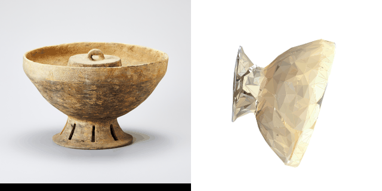
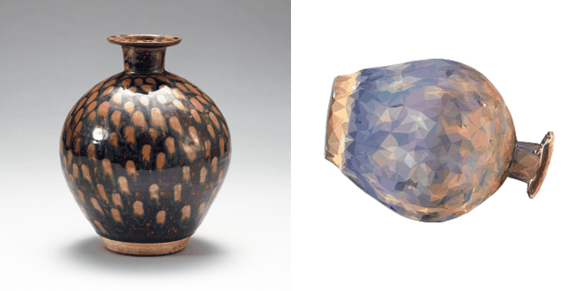
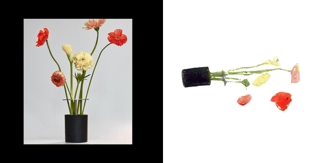
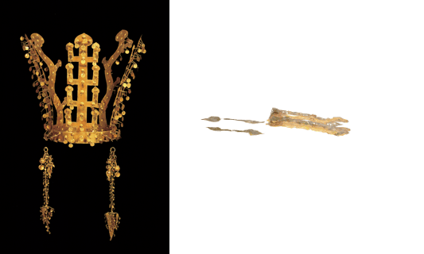
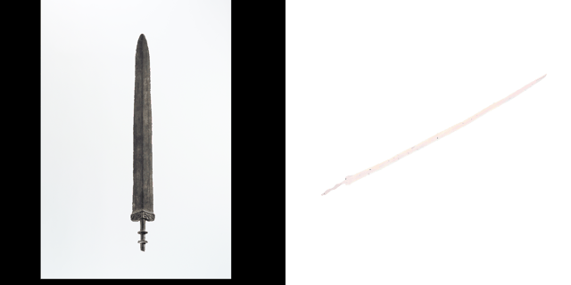
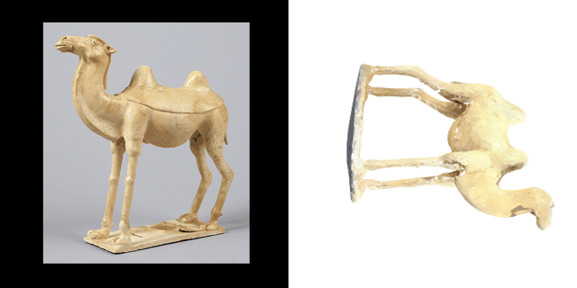
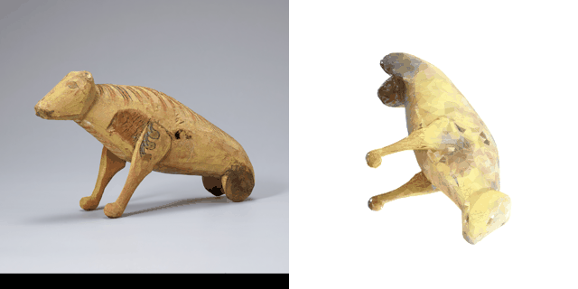
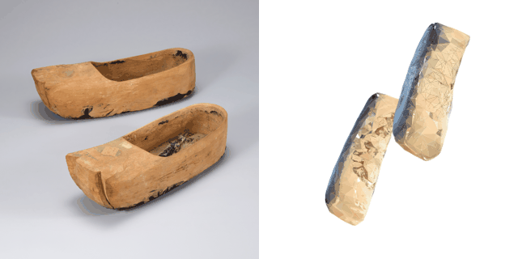
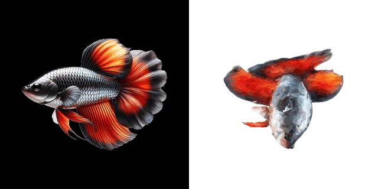
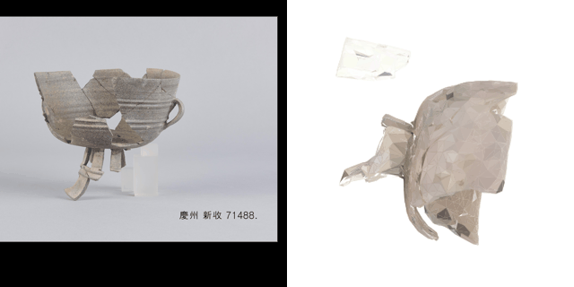

# 2026-09-04 학습 정리 — SPAR3D 단일 이미지 3D 복원 테스트

- 작성자: 김소영
- 학습 주제: 사진 한 장으로 문화재 형태를 복원하는 2D→3D 모델 후보(SPAR3D)를 실제로 돌려보고, 결과 메시가 팀의 점군·메시 파이프라인(공세민/[[김채원]] LiDAR+Poisson 라인)과 AI 결손 보완 실험 뒤에 이어 붙일 만한 품질인지 가늠
- 목표: "정확한 복원"이 아니라 **전시용 복원 가설을 만들 수 있는 입력**으로서 SPAR3D 결과물의 한계를 기록
- 사용 데이터: `inputs/vase2.jpg`, `inputs/comb-patterned pottery1.jpg` (분석 대상), 그 외 `camel.jpg`, `fish.jpg`, `fish2.jpg`, `fish3.png`, `shoes.jpg`, `stat.jpg`, `sword.jpg`, `vase3.jpg`, `vase3.jpeg`, `crown.jpg` — `vase3.jpeg`(꽃다발 사진)만 비문화재고 나머지는 전부 실제 유물/문화재 사진이라 4.1절에서 전부 정식 케이스로 분석했다
- 실행 환경: WSL2 Ubuntu, Python venv, [SPAR3D](https://github.com/Stability-AI/stable-point-aware-3d) (Stability AI, HEAD `fdc311b`), CUDA 사용 여부 미확인(기록 누락 — 다음 행동 참고)

---

## 1. 문제 정의

- 해결하려는 문제: 단일 정면 사진만 있는 상태에서 3D 형태를 얼마나 자동으로, 얼마나 그럴듯하게 만들어낼 수 있는가
- 입력: 유물 정면 사진 1장(JPG/PNG)
- 기대 출력: 텍스처 입힌 메시(`mesh.glb`) + 조건화용 점군(`points.ply`)
- 제약 및 가정:
    - 사진이 한 장뿐이라 **뒷면·바닥면·내부는 전부 추정 영역**이다
    - 배경/받침대 제거는 모델 내부 전처리에 의존하며 수동 마스킹을 하지 않았다
    - 입력 이미지 자체의 출처·저작권을 확인하지 않은 상태로 테스트만 진행했다(2절 참고)

## 2. 데이터

| 항목 | vase2.jpg | comb-patterned pottery1.jpg |
|---|---|---|
| 대상 | 신라계 뚜껑 있는 고배(굽다리 접시) 추정 | 빗살무늬 토기 추정 |
| 출처 | 미확인(웹 다운로드 추정) | 미확인(웹 다운로드 추정) |
| 라이선스 | **미확인 — 실제 반영 전 확인 필요** | **미확인 — 실제 반영 전 확인 필요** |
| 파일 경로 | `spar3d/inputs/vase2.jpg` | `spar3d/inputs/comb-patterned pottery1.jpg` |
| 손상 유형 | 표면 얼룩/변색(스캔 대상 아님, 사진 자체 노이즈) | 균열(구연부), 마모 |
| 전처리 | 모델 내부 배경 제거 + 정사각 패딩 (아래 참고) | 동일 |

모델이 실제로 받은 입력은 원본이 아니라 배경 제거·패딩을 거친 버전이며, 각 출력 폴더의 `input.png`로 저장된다. 두 장 모두 `김소영/images/2026-09-04/`에 복사해 두었다.

| vase2 (배경 제거 후) | comb-patterned pottery1 (배경 제거 후) |
|---|---|
|  |  |

camel/fish/shoes/sword/stat/crown 등은 처음엔 파이프라인 동작 확인용으로만 썼으나, 대부분 실제 유물 사진이고 실패 양상도 뚜렷해서 4.1절에서 정식 케이스로 다시 분석했다.

## 3. 방법

### 3.1 비교 기준선

- AI 없이 가능한 기준 방법: 없음 (수작업 3D 모델링은 시간 대비 비효율 — 이번 테스트의 목적은 "자동 후보 생성이 쓸 만한 출발점인지" 확인)
- 채택/비교 이유: SPAR3D는 점군 조건화로 뒷면을 보완한다고 주장하는 모델이라, 팀의 점군 기반 파이프라인과 접점이 있어 1순위 후보로 선택

### 3.2 AI 실험

- 모델명·버전: SPAR3D (Stability AI, `stable-point-aware-3d`, arXiv:2501.04689)
- 입력 조건: 단일 이미지, 텍스처 해상도 1024
- 프롬프트 또는 주요 파라미터: 텍스처 해상도 1024 (그 외 파라미터는 실행 로그를 남기지 않아 미기록 — 5절/6절 참고)
- 실행 명령/스크립트: `run.py` (실행 중 `args.reduction_count_type` 미지정 시 `AttributeError` 발생하는 버그를 발견해 `getattr(args, "reduction_count_type", "keep")`로 로컬 패치함, 업스트림 미반영)
- 출력 경로: `spar3d/output_pottery_angle_1024/0/`, `spar3d/output_artifact_1024/0/`

### 3.3 원본 vs 결과 비교 방법 (Blender 대체)

Blender MCP가 아직 연결되지 않은 상태라, 정식 렌더 대신 `trimesh` + `matplotlib`로 원본 사진과 생성된 메시를 나란히 놓고 18프레임 회전 GIF를 만들어 비교했다.

- 텍스처를 UV 기준으로 정점 색상에 베이크(`mesh.visual.to_color()`)
- 폴리곤이 5,000개를 넘는 메시는 `fast_simplification`으로 감소시키고, 원본 정점에 대한 최근접 탐색(KDTree)으로 색을 다시 붙임 — **렌더링 전용 경량화이며 산출물 자체를 수정한 것은 아니다**
- `matplotlib`의 `Poly3DCollection`으로 18방향(20°씩) 회전 렌더 → 원본 이미지와 나란히 GIF로 저장
- 카메라·조명 모델이 Blender/Unreal과 다르므로 **색감·음영은 참고용**이며, 형태·비율·자세 판단에만 신뢰해서 썼다

## 4. 결과 및 검증

| 항목 | vase2 (고배) | comb-patterned pottery1 (빗살무늬 토기) |
|---|---|---|
| 생성 성공 여부 | 성공 | 성공 |
| 메시 오류 여부 | 미검사(Blender 미검증) | 미검사(Blender 미검증) |
| 정점 / 삼각형 수 | 41,283 / 약 57,752 | 17,558 / 약 28,756 |
| 텍스처 해상도 | 1024×1024, 2장(JPEG) | 1024×1024, 2장(JPEG) |
| 조건화 점군 점 수 | 512점 고정 | 512점 고정 |
| Blender 임포트 | 성공 | 성공 |
| Unreal 임포트 | 미검증 | 미검증 |
| VR 표시 | 미검증 | 미검증 |

**주목할 점 — 조건화 점군이 입력과 무관하게 항상 512점으로 고정된다.** `output/`, `output_pottery_angle_1024/`, `output_artifact_1024/` 등 이번에 생성한 모든 `points.ply`의 `element vertex` 값이 512로 동일했다(내용은 다름, MD5 상이). 이건 SPAR3D의 점군 디노이징 모델이 고정 개수를 출력하는 스펙으로 보이며, 원본 형상을 촘촘히 담는 용도가 아니라 방향성 힌트 정도로만 봐야 한다는 뜻이다. 팀의 LiDAR 기반 점군(수백만 점, [[김채원]] 2026-08-28 참고)과는 성격이 완전히 다르므로 **두 점군을 같은 레벨로 취급하면 안 된다.**

- 원본 이미지: `spar3d/inputs/vase2.jpg`, `spar3d/inputs/comb-patterned pottery1.jpg`
- AI 생성 결과: `spar3d/output_pottery_angle_1024/0/mesh.glb`, `spar3d/output_artifact_1024/0/mesh.glb`
- Blender 수정 후 결과: 없음 (다음 행동 참고)
- 스크린샷/비교 이미지: 모델 입력 이미지만 확보(`김소영/images/2026-09-04/`), 메시 렌더 스크린샷은 이번 회차에 확보하지 못함

### 4.1 케이스별 원본·생성 결과 비교 (`spar3d/output/*`)

2절의 1024 텍스처 실험 2건과 별개로, 같은 세션에서 `run.py`/gradio로 이미 돌려놓은 결과 9건을 원본 사진과 나란히 비교했다. 각 GIF는 **왼쪽이 원본 사진, 오른쪽이 SPAR3D 결과 메시 회전**이다. 성공/실패 판정은 아래에 적지 않고, 5절 해석에서만 다룬다.

**bowl** — 원본: `vase2.jpg` (`07.bowl`, 41,283정점/57,752삼각형)

**glazedvase** — 원본: `vase3.jpg` (`03.vase2`, 20,992정점/35,576삼각형)

**flowervase** — 원본: `vase3.jpeg`, 비문화재 (`02.vase`, 10,970정점/12,628삼각형)

**crown** — 원본: `crown.jpg` (`8/0`, 10,217정점/11,188삼각형)

**sword** — 원본: `sword.jpg` (`01.sword`, 3,276정점/4,120삼각형)

**camel** — 원본: `camel.jpg` (`06.camel`, 16,874정점/23,392삼각형)

**egyptfigure** — 원본: `stat.jpg` (`04.cow`, 12,009정점/18,748삼각형)

**woodshoes** — 원본: `shoes.jpg`, 물체 2개가 한 사진에 있음 (`05.shoe`, 23,363정점/31,752삼각형)

**fish** — 원본 출처 불명(관상어 사진, `inputs/`에 해당 파일 없음, 폴더 `0`, 15,438정점/23,484삼각형)

`fish.jpg`/`fish2.jpg`/`fish3.png`(흰동가리 사진 3장)는 아직 생성 결과가 없다. 직접 돌려보려 했으나 실행 중 `inputs/fish3.png`를 못 찾는 오류로 중간에 끊겼다 — 다음 행동에 남겨둔다.

**brokenbowl** — 원본: 경주 신수 71488, 실제로 깨진 채 발굴된 토기 조각 사진 (`9/0`, 18,444정점/25,380삼각형)

이 케이스는 다른 것들과 성격이 다르다. 입력 사진 자체가 이미 파손된 유물(파편이 뜬 채로 재조립된 사진)인데, 결과 메시도 **파손된 형태를 그대로 유지**했다 — 조각 사이 빈 구멍, 따로 떨어진 파편까지 비슷하게 남아 있다. 즉 SPAR3D는 눈에 보이는 손상을 매끈하게 메워서 "복원"해주지 않고, 보이는 대로만 3D화한다. 팀이 원하는 "결손부 AI 보완"은 이 모델의 기본 동작이 아니라는 뜻이고, [[김채원]]의 PoinTr/U-Net 인페인팅 실험처럼 손상 영역을 별도로 마스킹하고 채우는 단계가 반드시 더 필요하다.

**패턴 1 — 회전대칭 용기류(그릇·병·원통 화병)는 자세 추정이 불안정하다.** bowl·glazedvase·flowervase 3건 모두 원본에서는 똑바로 서 있는데 결과 메시는 하나같이 90°에 가깝게 누워 나왔다. crown도 정면 대비 깊이(두께)가 0.2 수준으로 눌려 있어 비슷한 계열로 보인다. 반면 낙타·이집트 동물상처럼 비대칭 실루엣(다리·머리 방향이 뚜렷한)은 상대적으로 자세가 덜 흐트러졌다. 표본이 적어 확정할 수는 없지만, **정면에서 원형 단면·좌우대칭으로 보이는 물체는 "위/아래·앞/뒤"를 판단할 단서가 부족해서 자세 추정이 특히 취약해 보인다**는 가설을 세울 수 있다.

**패턴 2 — 폴리곤 수와 표면 디테일은 별개다.** glazedvase는 35,576개 삼각형으로 두 번째로 조밀하지만, 표범무늬 유약처럼 대비가 큰 무늬는 그대로 뭉개졌다. 메시를 촘촘하게 뽑아도 그 위에 입히는 텍스처/컬러 예측 자체가 흐릿하면 디테일은 살아나지 않는다 — **폴리곤 수는 디테일 보증 지표가 아니다.**

**패턴 3 — 얇고 납작한 형태(칼날, 지느러미, 꽃줄기, 관 장식)는 두께가 붕괴한다.** sword가 가장 극단적 사례이고 fish의 지느러미, flowervase의 줄기, crown의 세움장식도 같은 계열이다. 원본 형태 자체가 얇을수록 결과가 실 가닥/판때기처럼 무너지는 경향이 뚜렷하다.

**패턴 4 — 입력에 물체가 2개 이상이면 하나로 합쳐진다.** woodshoes(신발 2짝)에서 확인. crown도 관+귀걸이 2세트가 한 사진에 있어 같은 위험군이다. SPAR3D는 "사진 1장 = 물체 1개"를 전제하므로, 유물 여러 점이 함께 촬영된 사진은 반드시 개별 크롭 후 넣어야 한다.

## 5. 해석과 한계

- 관측된 원본 영역: 촬영된 정면 각도(대략 3/4 정면)뿐
- AI가 추정·생성한 영역: 뒷면, 내부(고배의 경우 뚜껑 안쪽·그릇 내부), 바닥면 전부. 텍스처도 보이지 않는 면은 모델이 지어낸 값이다.
- 실패 사례: 4.1절 비교에서 실제 실패가 다수 확인됐다 — 회전대칭 용기·장신구 자세 불안정(bowl/glazedvase/flowervase/crown), 얇은 형태 붕괴(sword가 가장 심함, crown·fish도 동일 계열), 다물체 입력 오인식(woodshoes, crown도 위험군), 조밀한 메시에서도 표면 디테일이 살지 않는 경우(glazedvase). 2절의 vase2/comb-pottery 1024 실험 2건은 육안상 무난했지만, vase2와 형태가 사실상 같은 `07.bowl`이 자세 문제를 보였으므로 **2절 결과도 자세를 별도로 확인하기 전까진 "무난하다"고 단정할 수 없다.**
- 정량 검증은 여전히 부족: Blender/Unreal 실제 임포트, 폴리곤 오류(비matmanifold, 뒤집힌 노멀 등) 검사, 스케일 단위 확인은 전 케이스 미실시. 이번엔 matplotlib 렌더로 형태·자세만 육안 비교했다.
- 결과를 역사적 정답으로 볼 수 없는 이유: 단일 사진 기반이라 뒷면·내부가 전부 추정치이고, 입력 이미지 자체의 출처·시대·손상 기록도 확인하지 않았다. 팀의 다른 실험들([[김채원]]의 LiDAR+Poisson, PoinTr/U-Net 결손 보완 실험)과 마찬가지로 "AI 결과는 정답이 아니라 복원 가설"이라는 결론을 그대로 적용해야 한다.

## 6. 다음 행동

- [ ] `mesh.glb` 전체를 Blender로 열어 스케일·축·메시 오류 확인 (Blender MCP 연결 필요 — 로컬에 BlenderMCP 애드온 설치 후 `claude mcp add`로 등록, [[김채원]]이 쓴 `localhost:9876` 방식 참고)
- [ ] Blender MCP 연결되면 **자세 보정(회전대칭 용기류 재정렬)을 후처리 스텝으로 표준화** — 4.1절 패턴 1이 맞다면 매번 수동으로 눕는 방향을 바로잡아야 함
- [ ] Blender에서 턴테이블/정면·후면 스크린샷 생성해 이 문서의 GIF를 정식 렌더로 교체
- [ ] Unreal 임포트 및 VR 표시 검증
- [ ] 회전대칭 용기(그릇/병/원통) 자세 불안정 가설을 더 많은 샘플(10건 이상)로 검증 — 지금은 3건뿐이라 우연일 가능성 배제 못함
- [ ] 얇은 형태(칼날류) 붕괴 문제는 SPAR3D 설정(포인트클라우드 조건화 강화, 해상도 상향 등)으로 개선되는지 별도 실험
- [ ] 다물체 입력은 사전에 개별 크롭해서 넣는 전처리 규칙을 팀 가이드에 추가
- [ ] `vase2.jpg`, `comb-patterned pottery1.jpg`의 실제 출처·라이선스 확인 — 실 데이터로 못 쓰면 팀 자체 촬영/공공 데이터로 교체
- [ ] 이번 실행에 사용한 정확한 CLI 파라미터를 다음부터는 명령어 그대로 로그에 남기기 (이번 회차는 사후 추정으로 재구성함)
- [ ] `run.py`의 `reduction_count_type` AttributeError 패치를 업스트림 이슈로 등록할지 판단
- [ ] `fish.jpg`/`fish2.jpg`/`fish3.png` 결과 생성 마무리 — 직접 실행 중 `inputs/fish3.png` 파일을 못 찾는 오류로 중단됨(파일이 실행 중 이동/변경됐을 가능성), 파일 목록 고정한 뒤 재시도

## 7. 산출물 목록

| 파일 | 용도 |
|---|---|
| `spar3d/output_pottery_angle_1024/0/mesh.glb` | vase2 SPAR3D 복원 메시 |
| `spar3d/output_pottery_angle_1024/0/points.ply` | vase2 조건화 점군(512점) |
| `spar3d/output_artifact_1024/0/mesh.glb` | 빗살무늬 토기 SPAR3D 복원 메시 |
| `spar3d/output_artifact_1024/0/points.ply` | 빗살무늬 토기 조건화 점군(512점) |
| `김소영/images/2026-09-04/vase2-model-input.png` | 모델이 실제로 받은 전처리 후 입력(배경 제거) |
| `김소영/images/2026-09-04/comb-pottery-model-input.png` | 모델이 실제로 받은 전처리 후 입력(배경 제거) |
| `김소영/images/2026-09-04/bowl.gif` | 고배(`vase2.jpg`) — 원본 vs 결과 회전 비교 (자세 문제 확인용) |
| `김소영/images/2026-09-04/glazedvase.gif` | 유약 도자 병(`vase3.jpg`) — 원본 vs 결과 회전 비교 (자세+디테일 문제) |
| `김소영/images/2026-09-04/flowervase.gif` | 화병(`vase3.jpeg`, 비문화재) — 원본 vs 결과 회전 비교 (자세+줄기 붕괴) |
| `김소영/images/2026-09-04/fish.gif` | 출처 불명 관상어 사진 — 원본 vs 결과 회전 비교 |
| `김소영/images/2026-09-04/sword.gif` | 청동검(`sword.jpg`) — 원본 vs 결과 회전 비교 |
| `김소영/images/2026-09-04/camel.gif` | 당삼채 낙타상(`camel.jpg`) — 원본 vs 결과 회전 비교 |
| `김소영/images/2026-09-04/egyptfigure.gif` | 이집트 목재 동물상(`stat.jpg`) — 원본 vs 결과 회전 비교 |
| `김소영/images/2026-09-04/woodshoes.gif` | 목재 유물 2점(`shoes.jpg`) — 원본 vs 결과 회전 비교 (다물체 오인식) |
| `김소영/images/2026-09-04/crown.gif` | 신라 금관 추정(`crown.jpg`) — 원본 vs 결과 회전 비교 (자세+두께 붕괴) |
| `김소영/images/2026-09-04/crown2.gif` | 신라 금관 추정, 동일 입력 재실행(`output/10`) — 비결정성 확인용 |
| `김소영/images/2026-09-04/brokenbowl.gif` | 경주 신수 71488, 실제 파손 유물(`output/9`) — 손상 미복원 확인용 |
