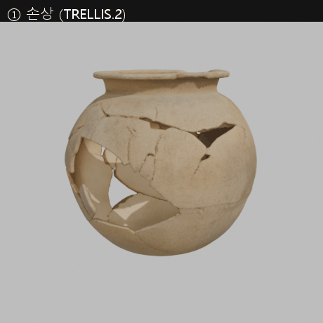
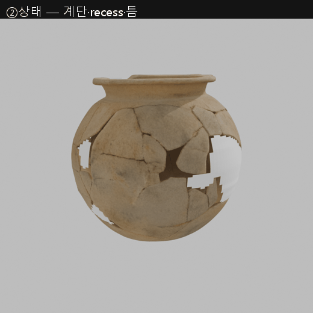
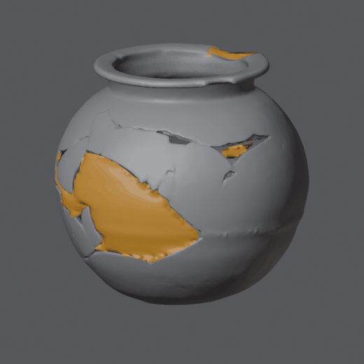

# 적색연질토기호 복원 실험 — 회전대칭 알고리즘 트랙 (①②) + MCP 보조 실험

## 대표 실행과 수치 기준

이 문서의 대표 실행은 `model-restore-symmetry@2026-09-08T08:33:33.600021+00:00`(기록 시각 기반 식별자, KST 17:33)이다. 근거는 `assets/PS0100324600100049700000/records/model-restore.json`, 설정은 `configs/PS0100324600100049700000.json`이다. 설정 파일은 이후 변경될 수 있으므로 재현 시 실행 기록의 `params`도 대조한다.

- 입력 SHA-256: `332ec9ae0e886a9483fb27af643742a9315daa46eb32f696e68c521689922f37`
- 출력 SHA-256: `60af3ea3360c889f195ead0db3387d8684e91f892ce43fb6356ba12d821b1ad8` (해당 파일 식별용, 재실행 동일성 보장 아님)
- 외면 프로파일 p95, 큰 결손 추정 면적 85.5 cm², 소결손 합계 16.3 cm², 경계 스냅 225정점, 출력 148,092삼각형.
- 채움 대상 675셀 중 675셀을 채웠다. 도너 부족 시 남기는 조건은 있지만 이 실행에서는 해당 셀이 0개였다.
- 미세요철 전사는 구현·실행됨(적용 표준편차 0.84 mm). canonical content digest는 미구현이다.
- 기존 JSON의 `confidence`·‘실측’ 표현은 생성 메시 기반 기하 지지 점수로 해석한다. 큰 결손 평균 0.484는 정답 확률 48.4%가 아니다. 원본 사진 이외의 3D는 모두 추정이다.


- 작성자: 김소영
- 목표: 사진 1장에서 복원 파이프라인을 **품질과 무관하게 경로가 끊기지 않고** 관통
- 대상: 적색연질토기호, 창녕박물관 창박 497, e뮤지엄 `PS0100324600100049700000`
- 실행 환경: Windows, TRELLIS.2 로컬(RTX 4070 Laptop 8GB), Blender 5.2.1

---

## 0. 한 줄 요약

**사진에서 TRELLIS로 3D를 생성하고, 회전대칭 기하 알고리즘으로 결손 후보를 채웠다.** LLM·에이전트 런타임 의존 없음.
`③ MCP`는 별도 실험으로만 남김 — 청소 수준이라 별도 복원 '방식'으로 보기 어렵고, 그 청소는 ②에 흡수함.
형상 근거는 전부 회전대칭 가정 하나. 명세 §19.1이 "MCP 없으면 2단계로 통과"를 허용.



```
사진(_0)
  │  run_pipeline.py  (config 하나로 아래 전부)
  ├─ TRELLIS.2-4B        image→3D
  │     ▼
  │  ① 1-damaged.glb     손상 상태를 추정한 생성물. 사진에 안 보이는 면 전부 추정
  │     │  좌표·단위 규약 정규화  (균등 스케일만, 바닥중심 pivot, glTF Y-up)
  │     ▼
  └─ 회전대칭 완성 + 청소  축추정(z-slice 원피팅 중앙값) → θ-h 격자로 결손 분리
        ▼                → profile(h) 회전 복제 → seam weld → 경계고정 Laplacian → 두께
     ② 2-model-restored.glb   region_carried / region_filled 노드 분리

  (곁가지) ③ MCP 실험 — ② 결과에 Blender+agent로 solidify/voxel remesh/smooth. records/experiments/mcp/
```

전략 라우팅·부분매칭·PartField는 이번 단일 회전대칭 몸통 실험 범위에서 제외했다. 범용 유물에 불필요하다는 뜻은 아니다.

---

## 1. 대상 유물

| 입력 사진 (`_0`, 생성에 사용) | 검증 사진 (`_2`, 생성에 미사용) |
|---|---|
|  |  |

| 항목 | 값 |
|---|---|
| 명칭 | 적색연질토기호 (赤色軟質土器壺) |
| 소장 / 시대 | 창녕박물관 (창박 497) / 삼국시대 |
| 실측 | 높이 24.4 · 너비 17.6 · 바닥지름 8.0 cm |
| 이미지 출처 | e뮤지엄, 원본 7200×5127 |
| 라이선스 | **공공누리 제1유형(출처표시)** — 확인 완료 |
| 결손 | 몸통 한쪽 큰 개구부 + 구연부 작은 노치 |

---

## 2. 단계별 결과

### ① 손상 — TRELLIS.2-4B

- `1024_cascade`, 14/14/14 steps, seed 1, decimation 150k, texture 1024. 약 12분.
- 검증(검증 사진 `_2`와 대조): 외반 구연·구연부 노치·큰 개구부 모두 재현. 파단면 광택 blob,
  접합선 두꺼움, 안 보이던 뒷면은 창작 — 수직 슬라이스 기준 OK.

### 좌표·크기 정규화 (좌표·단위 규약) — `canonicalize_master.py`

- meter, 바닥중심 pivot, 교환 GLB는 glTF 표준 Y-up(엔진 import 시 Z-up).
- **실물 높이 기록은 있으나 생성 메시의 실측 정확도는 미검증(scaleKnown=false).** 균등 스케일로 높이만 24.4 cm에 맞춤(검수자 지정).
- 비율 이슈: 생성물 H:W ≈ 0.97 / 사진 `_0` ≈ 1.19 / 기록 24.4:17.6 = 1.386 — **세 값 불일치.**
  한때 Y×1.43 비균등 스케일로 기록에 맞췄으나 **철회** — 좌표·단위 규약은 균등 크기만 검수자 재량,
  scaleKnown=false 생성물 비율을 기록에 강제하는 건 부적절.
- 바닥지름 교차검증: GLB(높이 24.4 기준) ≈ 8.5 cm vs 기록 8.0 cm → 세로 비례는 대체로 신뢰.
  불일치는 몸통 폭에 몰림(기록 '너비'가 동최대경인지 불명). 실물 비율 확정엔 실측 스캔 필요.

### ② 모델복원 — `stage2_symmetry_complete.py`

물레 성형 토기는 `(반지름, 높이)` 곡선 하나로 완형이 된다. 공세민 고배(2026-09-04) 방법을 메시 네이티브로 이식.
권영호 Track A는 LAS 점군 입력이라 모달리티 불일치로 미채택.

1. **축추정** — 48구간 최소제곱 원 피팅 → 중심 **중앙값**(평균 아님, 파편 쏠림 때문). bbox 중심과 0.8 mm.
2. **프로파일** — `(r,θ,h)` 전개, 높이 빈마다 p95 외면 반지름 + 벽두께만큼(2.5 mm) 바깥 오프셋 → `profile(h)`.
3. **결손 분리** — θ-h(120×96) 점유격자에서 입구·바닥에서 flood-fill 도달 = 개구부,
   갇힌 빈 셀 = 결손. 립 상단 3 bin 제외. → 결손 4구역(큰 몸통 85.5 cm² + 소결손 16.3 cm²).
4. **채움** — `r = profile(h)`로 회전면 생성 (`region_filled`).
5. **결정론적 청소** *(이전 MCP ③ 역할 흡수 + 보강)* —
   ㄱ) 채움면 경계 225정점을 carried **최근접 표면점**에 BVH 1회 스냅(10 mm) → seam 틈·recess 대부분 소멸
   ㄴ) 경계 고정 Laplacian 3회, 얇은 solidify 3 mm → `region_filled` non-manifold 0
   ㄷ) **미세요철 전사** — 잔존 표면의 반지름 잔차를 고역통과(매크로 형상 제거) 후 같은 높이·최근접 각도에서
       채움면에 방사 전사 (적용 std 0.84 mm). 백지 매끈면 → 물레자국류 질감. 단 그 무늬는 원래 그 자리 게 아니라 복사본.
   ㄹ) **셀별 기하 지지 점수**(주변 생성 메시 커버리지)를 `COLOR_0` 정점색으로 — 큰 몸통 결손 0.48 / 소결손 0.63~0.67

출력: `region_carried`(①에서 전달된 **TRELLIS 생성 메시**, 정점 일절 미변경) + `region_filled`(`fill_ai_inferred` + 신뢰도색) 별도 노드(FR-UI-008).
여기서 "원본 보존"은 실제 유물의 계측 3D 원본이 아니라, 사진에서 생성된 ① 메시를 후속 단계가 변경하지 않는다는 뜻이다.
①② 동일 프레임. 채움면이 실제 파단 엣지에 닿으며 Y bbox 252→258 mm(carried 지오메트리·pivot은 ①과 byte 동일).


### ③ MCP 실험 (곁가지, `records/experiments/mcp/`)

②-damaged가 아니라 이전 ② 결과에 Blender MCP(agent) — solidify → voxel remesh → smooth.
스무딩이 free-boundary 패치를 4번 붕괴시킴 → voxel remesh로 해결(실패 과정 그대로 `mcp-prompts.md`).
결과 품질은 ②의 청소와 비슷. **별도 복원 방식으로 보기 어려워 메인 경로에서 제외**,
"에이전트로도 해봤다" 근거 + G4 기술 증거로만 보관.



---

## 3. 팀 규약과 검토 상태 (참고)

- 좌표: ①② bbox `[0.252, 0.252/0.258, 0.244] m`, pivot z=0. carried 지오메트리는 ①②가 byte 동일 → 토글 시 안 튐. (Y 6 mm 차이는 ② 채움면이 실제 파단 엣지에 닿아서. 엄격 일치 필요시 `--seam-snap-radius 0`)
- `manifest.json`: §19.2 필수 필드 전부. `records/`: 단계별 run·`canonical-transform.json`·`model-restore.json`.
- provenance: ①② 전부 `ai_inferred`(§3.1). observed 3D 스캔 없음.
- 복원 2단계 — §19.1: MCP 없으면 2단계로 통과. G4/U-05 미판정 상태와도 정합.

---

## 4. 한계

- 실측 3D 스캔 없음 → 전체가 사진 1장 기반 복원 가설. "계측 기반 복원"이라 하지 않음(NFR-ETH-004).
- ①② 채움 형상 근거는 **회전대칭 가정 하나뿐.** 원래 그 자리 형상·무늬 근거 없음.
- ① TRELLIS 메시가 비수밀(1917 조각, non-manifold edge ≈42k). ②가 carried로 물려받으며 원본 보존 규약에 따라 미수정.
- ② recess는 프로파일 오프셋+경계 표면스냅으로 대부분 해소. 파편이 국소적으로 튀어나온 몇 곳에 작은 proud(≤~3 mm) 지점 잔존.
- ② 채움면 형상은 여전히 회전대칭 가정뿐 — 미세요철 전사는 완료했으나 다른 각도에서 복사한 추정 무늬이며 실제 해당 위치의 무늬는 확인되지 않았다.
- ② 기하는 결정론적(지표 고정: `seam 225정점`, `trisOut 148092`, 신뢰도 by-region). **GLB 바이트는 재현 보장 안 됨**
  — Blender glTF 익스포터가 정점·버퍼 순서를 고정 안 함. canonical content digest 검증은 아직 미구현이다.
- 외부 문화유산 전문가 검토 없음.
- **G4(Blender MCP 복원 가능성) 게이트 팀 공식 판정 없음** (§4부 U-05 미확정). MCP는 곁가지 실험으로만 보관 —
  판정·`DECISIONS.md` 갱신은 팀 몫.

---

## 5. 팀 후속 작업 (참고)

G4/U-05는 Blender MCP 활용 가능성에 대한 팀 승인 항목이다. 알고리즘의 정확도 점수가 아니다.

| 항목 | 담당 |
|---|---|
| master ② 복원 타당성 검토 (경량화보다 먼저) | 팀 |
| `runtime/` 경량화 (≤30k tri, ≤1024 texture, thumbnail) | VR |
| 공식 눈 검수 → `review.decision` | 팀 |
| G4 공식 판정 + `DECISIONS.md` + U-05 해제 | 팀 회의 |
| `ssu022891` Pot_3_Pristine 이 실제 MCP 산출물인지 검증 (별개 자산, 자동 해소 안 됨) | AI |

---

## 6. 재현

```bash
python scripts/run_pipeline.py --config configs/PS0100324600100049700000.json
# TRELLIS 12분 건너뛰려면 (raw GLB가 이미 records/ 에 있을 때):
python scripts/run_pipeline.py --config configs/PS0100324600100049700000.json --steps canonicalize,symmetry
```

파라미터 전부 `configs/PS0100324600100049700000.json`. 알고리즘 상세는 `heritage-3d-restoration/METHOD.md`.


---

## 7. 2026-09-09 추가 — 축 검증(§2) · 국소 패치(③ 재작업) · 상태/모드(§1)

원본 산출은 로컬 실험 작업공간에 있으며, 이 절은 대표 결과와 한계를 기록한다.

### 7.0 배경

**왜 축을 검사하나.** ②는 "물레 성형 토기는 (반지름, 높이) 곡선 하나를 회전축 둘레로 돌리면
완형"이라는 가정으로 결손을 채운다. 축이 틀리면 그 회전면 전체가 틀어진다 → **채우기 전에
축을 믿어도 되는지 본다.**

**왜 국소 패치(③ 재작업).** 이전 완형 후보 `backing`은 유물 전체 뒤에 완형 껍질을 하나 더
겹쳐 놓는 방식이라, 각도에 따라 멀쩡한 파편을 덮거나 두껍게 보였다. → 파편은 그대로 두고
**명시된 결손 영역에만** 붙는 패치로 바꿨다.

**후보 현황.** 이제 3종: `2-model-restored.glb`(conservative, ②) / `2-model-restored-complete.glb`
(backing, ②) / **`2-model-restored-local.glb`(local patch v3, ③) = 현재 검토용 후보.** 앞 둘은
이전 시도이며 불변으로 남겨둠.

**용어** (`§N` = `heritage-3d-restoration/DESIGN_v1.md` 절 번호):
| 용어 | 뜻 |
|---|---|
| 게이지 고정 origin | 축 직선은 방향(2) + 위치(2) 4자유도인데, 축을 따라 미끄러지는 자유도를 없애 한 표현으로 고정 |
| probe | 축 추정의 안정성 시험 (조건을 바꿔 축이 얼마나 움직이나) |
| warm / cold (재적합) | warm = 전체 데이터로 얻은 축에서 다시 맞춤 / cold = 아무 정보 없이 밑바닥부터 |
| height-field solve | 패치 정점을 3D 자유가 아니라 **반지름 하나만** 미지수로 두고 (θ,h는 격자로 고정) 푼다 |
| 호길이 등방 좌표 | Delaunay 전에 θ를 `θ·반지름`(미터)로 바꿔 θ축·h축 스케일을 맞춤 |
| rotationFitStatus | "회전면 모델 자체가 이 형상에 맞나" (타원 단면·혹이면 축은 맞아도 회전면은 부적합) |
| covered / empty 셀 | 외벽 면이 투영된 θ-h 격자 셀 / 안 된 셀 (구멍 후보) |
| decision 값 | `fill_candidate` 검토용 채움 / `fill_automatic` 자동 채움 / `preserve` 보존 / `unresolved` 미해결로 남김 |
| reviewStatus 값 | `axis_warning` 축 미통과지만 후보 생성 / `axis_blocked` 축 미통과로 자동채움 차단 |

### 7.1 robust-axis-v1 (§2) — 복원 전 회전축 신뢰도 검사

stage2·local_patch는 자체 48밴드 원피팅 축을 계속 쓴다. `robust-axis-v1`(`scripts/robust_axis.py`,
codeHash `6e71e720d22d1aad`)은 **별도 검사**로, 그 축을 믿어도 되는지 판정을 내고 후보에
경고로 붙인다. 합성 데이터로 보정·평가했다.

- 추정기 = 밴드 원피팅 → RANSAC 중심선 → 게이지 고정 origin + multi-init(초기축 여러 개 중
  잔차 최소 선택; 짧고 넓은 조각은 PCA 주축이 수평이라 단일 시작이 조용히 실패했음).
- 게이트 2분리: `axisStatus`(supported / insufficient_evidence — 축을 믿을 수 있나) +
  `rotationFitStatus`(회전면 모델이 맞나). probe 3개 독립:
  ① 작은 표본 변화 민감도(warm 재적합) ② 정보 일부 제거 의존도(같은 부분집합 warm+cold 비교)
  ③ 경쟁축 — 서로 다른 방향의 축도 비슷하게 설명하나(구면 분산 초기축 + 방향 강제 후 재적합).
- `scripts/synth_revolve.py` 합성 세트(정답 축을 아는 인공 회전체): 원통·배부름·**완전한 구**·
  회전타원체·짧은조각·타원단면·국소혹·비동축.
- **보정 세트(seed0, 97건)에서 임계값 후보를 고르고 → 전체 설정 고정 → 별도 평가 세트(seed1,
  97건)에서 검증:** 게이트가 회전 복원을 **허용한** 케이스 62/97, 그중 실제 축 방향 오차>2° 또는
  위치 오차>5mm인 케이스 **0건** (허용 집합 worst 0.89° / 2.37mm). 정확한 구는 4/4 전부 차단
  (고유 축이 없으므로; 중심 오차 0.11mm). 짧은 조각(멀티 초기축 덕에) 최대 방향 오차 0.27°.
  → **§2.7 = "합성 데이터 기반 1차 보정·독립 평가 완료".** 임계값은 잠정치(provisional) —
  옮기려면 새 표본 필요. `records/eval/axis-robust-v1-calibration-FROZEN.json`, `axis-robust-v1-eval.json`.

**실물 적용** — `scripts/axis_gate.py` → `records/axis-gate.json`:
적색연질토기호 실제 TRELLIS 메시는 **게이트 미통과**. `axisStatus: insufficient_evidence`
(`competing_axis_candidates` + `local_refit_sensitivity`), 방향 재표집 p95 3.34°.
내·외벽·파단면·1959조각 섞인 입력이 원인 추정 (환경 차이 아님 — 로컬 검증 기록
**경고 채널이지 하드 게이트 아님.**

### 7.2 ③ 재작업 — symmetry-guided local patch

`scripts/local_patch.py` v1→v3. (재작업 이유는 7.0.)

- v1: 결손을 θ-h 직사각형으로 마스킹 + 경계 정점을 3D 최근접 표면에 스냅 → 외벽·내벽·파단면에
  섞여 붙어 긴 삼각형(톱니), 직사각형이라 실제 구멍보다 좁음. 폐기.
- v2: 격자 flood-fill로 실제 구멍 윤곽 추출 + 내부 반지름 height-field solve. 잔여 삼각형 조각
  (debris) 남음.
- **v3 (동결):**
  1. 외벽 면 선택 — `radial_dot > 0.30`(법선이 바깥) **and** 중심 반지름이 `profile(h) ± 밴드`.
     셔터드 메시라 연결성 추적 대신 프로파일을 외벽 기준으로 씀. 내벽(작은 r)·파단면(법선 수직)은 빠짐.
  2. 그 면들을 면적비례 점 샘플로 θ-h 격자에 래스터 → `covered`.
  3. 빈 셀을 입구·바닥에서만 flood-fill → 갇힌 빈셀 = 실제 구멍 (직사각형 아님).
  4. 구멍 경계를 covered/empty 셀 경계선에 두고, 그 지점의 외벽 반지름에 고정 (링 따라 중앙값 필터).
  5. 경계점 + 내부 셀중심을 호길이 등방 좌표에서 Delaunay 삼각화 → 내부 반지름을
     **`min Σ‖rᵢ − 이웃평균‖² + λ Σ‖rᵢ − profile(hᵢ)‖²`** 로 품 (경계는 고정).
     = 경계는 파편에 딱 붙이고, 내부는 이웃과 부드럽게 이으면서 회전 프로파일로 유인. λ 클수록 프로파일 쪽.
  6. 구연부 노치는 **별도 립 단면 복원** — 외반 립은 같은 높이에 반지름이 여럿이라 `profile(h)`
     한 값으로 안 됨. 양옆 온전한 각도에서 립 단면 (호길이 정렬 곡선) 뽑아 블렌드·회전 스윕.
  7. `patch → carried` BVH 거리로 겹침·seam 기록.
- 두께 없음(단면). 파단면 정밀 정합·필 스컬프팅은 외부 메시 도구(Blender sculpt 등). 두께(§4)는
  형태 리뷰 통과 후 (파단면 근처 실측 두께만, 근거 없는 중앙부는 미판정).
- 산출 `master/2-model-restored-local.glb` (`region_carried` 불변 + `region_filled`),
  `records/local-patch.json` v3.




### 7.3 §1 영역 상태 + 실행 모드

각 영역을 왜 채웠거나 보존했는지 기록하고 자동/검토 실행을 분리. `scripts/region_state.py`,
`records/region-states.json`. 입력=`configs/restore-regions-<id>.json`(사람이 지정한 결손 영역).

| id | currentState | cause | causeSource | decision | geometrySource |
|---|---|---|---|---|---|
| 2·1·3 (몸통 결손) | void | damage_loss | human_review | fill_candidate | rotational_profile |
| 6 (구연 립 노치) | void | damage_loss | human_review | fill_candidate | lip_section_copy |
| mouth (입구) | void | **intentional_opening** | human_review | **preserve** | carried |
| base (바닥) | **surface_present** | — | — | **preserve** | carried |

바닥 = 사진에서 둥근 바닥+굽이 보존되고 실측 바닥지름 8.0cm와 대체로 일치하므로, **본 실험에서는
`surface_present`·`preserve`로 판정했다.** 단일 사진과 생성 메시만으로 실제 내부 폐쇄 구조까지
계측 확인한 것은 아니다.

**실행 모드** (`--mode review|automatic`, `local_patch.py`·`stage2` 공용):
- `review`: 축 미통과여도 후보 생성 + `reviewStatus: axis_warning`.
- `automatic`: `axisStatus==supported AND rotationFitStatus==compatible`일 때만 채움. 미통과 시
  후보 생성 안 함, **채우지 못한 영역만** `unresolved`/`axis_blocked` — 유물 전체 `region_unresolved`
  복제 안 함.
- 현재 유물: `executionMode: review`, `automaticFillAllowed: false`, `candidateGenerated: true`,
  `reviewRequired: true`.

### 7.4 한계 (7절 추가분)

- 실물 축이 robust-axis-v1 게이트를 통과하지 못함 → local patch·② 후보의 프로파일 축은
  검증 안 된 기본 추정. 검토용 가설이며 자동 승인 아님.
- local patch v3 rim에 1~2셀 폭 얇은 미채움 잔존. 파단면 정밀 정합은 이 파이프라인 범위 밖.
- §3 결손/개구부 판별기·§5 부위 Cₙ은 투창 유물(굽다리바리/고배) 확보 후.
- robust-axis-v1 임계값은 합성 2세트로만 검증됨. 이동 시 새 표본 필요.

### 7.5 재현 (7절 산출)

```bash
# §2 축 게이트 (기존 실물 실행 임포트)
python scripts/axis_gate.py --out assets/<id>/records/axis-gate.json \
    --from-run <robust-axis 실물 summary.json> --pick all_exact_environment_control

# ③ 국소 패치 (검토용)
blender -b --python scripts/local_patch.py -- assets/<id>/master/1-damaged.glb \
    assets/<id>/master/2-model-restored-local.glb \
    --config configs/restore-regions-<id>.json --records-dir assets/<id>/records --mode review

# robust-axis-v1 합성 보정·평가
python scripts/synth_revolve.py --out records/eval/synth_axis --seed 0
python scripts/robust_axis.py --eval records/eval/synth_axis/calibration --json records/eval/axis-robust-v1-calibration.json --seed 0
python scripts/robust_axis.py --eval records/eval/synth_axis/eval        --json records/eval/axis-robust-v1-eval.json        --seed 1
```

설계 상세: `heritage-3d-restoration/DESIGN_v1.md` (Codex 협업 로그 포함).

---

## 8. 2026-09-10 추가 — 후보 비교 렌더 · 측정용 GT 탐색 · seam 정리

원본 산출은 로컬 실험 작업공간(`AI-PJ/axis-integration-review/`)에 있으며, 이 절은 대표 결과와 한계만 기록한다.
상세 기록: `heritage-3d-restoration/records/eval/p0-render-compare.md`, `seam-weld-v1.md`.

### 8.0 한 줄 요약

**네 후보(damaged / local patch / backing / revolve)를 같은 카메라·광원·엔진으로 렌더해
결함을 숨기지 않고 비교했다.** 이어서 복원 정확도를 잴 실측 GT를 찾았으나 형태가 맞는 완형
스캔이 없어 **정량 평가(P1)는 보류**했고, local patch 경계의 톱니·틈은 결정론적 seam 정리로
**gap 중앙값 1.57 → 0.34 mm**까지 줄였다.

파이프라인상 위치: §7의 local patch v3 이후 — 만든 것을 (a) 정직하게 보여주고 (b) 잴 기준을
구하고 (c) 경계를 다듬는 세 갈래.

### 8.1 네 후보 동일 조건 비교 렌더


- 대상 4종: `1-damaged`(TRELLIS 생성물) / `2-model-restored-local`(검토 후보, §7.2) /
  `2-model-restored-complete`(backing) / revolve 완형 후보.
- 같은 union bbox 프레이밍·grey 0.62·sun 52°/35°·EEVEE 1000². 3종 pass —
  `form`(중립 매트, 형태·결함) / `provenance`(carried 회색·추정 오커) / `confidence`(정점 채널).
  총 80장 + close-up + x축 cutaway.
- **목적은 "예쁜 완성품"이 아니라 각 후보가 왜 아직 final이 아닌지를 드러내는 것.**
  local patch 경계 톱니, backing 구멍 가장자리 계단이 close-up에 그대로 보인다.
- 재현 config·렌더러 SHA·입력 GLB SHA를 manifest에 기록. 별도 검증 스크립트로 80장 해시
  대조 → **PASS(불일치 0)**. 동일 머신 무결성 검증이며 교차 머신 바이트 재현 보장은 아님.
- 이 렌더 세트(v2)는 Codex agent가 headless Blender CLI로 생성했다(Blender MCP 미사용).

### 8.2 측정용 GT 탐색 — 형태가 맞는 실측 완형 스캔이 없다

**왜 필요한가.** §4대로 지금 3D는 전부 사진 1장 기반 추정이다. TRELLIS 메시를 정답 삼아
복원 오차를 재면 "우리 추정 대 우리 추정"이라 순환이다. 합성 손상 평가에는 **실제 계측된
완형 스캔**이 있어야 한다.

네 소스를 뒤졌다:

| 소스 | 결과 |
|---|---|
| 국립중앙박물관 3D | "토기" 총 **3건**. 주구토기(주구 有) · **빗살무늬토기**(순수 회전체) · 기마인물형토기(조형). KOGL 1유형, 로그인 없이 직접 다운로드 |
| 국가유산청 디지털서비스 「천년 신라 왕경」 | 단경호·유개단경호 등 회전체 토기 다수. **그러나 18/18 전부 `제작방식: 고증`(FBX/PNG)** = 고고 자료 기반 재현 모델. 스캔 아님 → GT 부적격 |
| 문화공공데이터광장 3D | 76건 전부 건축·인쇄·병풍·직물. 토기 없음 |
| Sketchfab (CC0/CC-BY) | 실측 완형 토기 스캔이 희박. 유일 근접(에트루리아 olla)이 CC BY-NC-**ND**라 파생 금지 |

→ **쓸 수 있는 실측 GT는 국중박 빗살무늬토기(`ssu022891` = 3D id 36933) 하나뿐.**


topology + 회전대칭 적합도 게이트(신규 스크립트)로 검사:

- 195,777정점 / 391,456면. **회전축 안정성·좌우 프로파일 차·회전체성 전부 통과**
  (R1 0.054 / R2 0.015 / R3 0.113, 임계 0.10 / 0.05 / 0.20).
- topology 경미 미달: 컴포넌트 9개(8개가 합 91정점짜리 스캔 부스러기 = 0.047%),
  boundary edge 126개. non-manifold 0, 바닥 존재, 양의 부피.
- **형태 클래스가 다르다.** 빗살무늬토기는 수날법 성형 **첨저 원추형**, 적색연질토기호는
  물레 성형 **구형**. 회전체인 건 확실해 축·회전 프로파일 방법은 그대로 적용되지만,
  구형 항아리의 배–어깨–목 변곡(어려운 지점)이 없다.

**결론: P1 정량 평가는 이 스캔으로 돌리면 "방법·하네스가 실측 지오메트리에서 작동하는가 +
단조 프로파일 구간 성능 하한"까지만 말할 수 있고, "적색연질토기호 난이도"는 검증 못 한다.**
동일 형태 계열의 실측 스캔을 구하기 전까지 본실행 보류.

### 8.3 seam 정리 — local patch 경계의 톱니·틈·돌기 (결정론적, 파이프라인 내)


**원인.** `local_patch.py`가 결손을 θ-h 격자로 잘라 채우므로 경계가 격자 계단을 따라간다.
게다가 단발 BVH 스냅(10 mm)이 경계 265정점 중 상당수를 carried 표면에 못 붙였다
(스냅 전 최대 간격 21.6 mm). `region_carried`는 파편 메시라 boundary edge가 42,262개 —
깨끗한 구멍 링이 없어 두 경계를 잇는(zip) 방식은 불가.

**처리** (`scripts/weld_seam.py`, 패치 쪽만 손봄):
경계 루프 arc-length 저역통과 → carried **외벽 면**에만 국소 평면 적합 후 투영(파단 단면은
제외) → 반복 → 경계 고정 Laplacian → 경계 collar 노멀 블렌드. filled 노드의 POSITION/NORMAL
바이트만 교체해 COLOR_0·인덱스·머티리얼 보존.

| 지표 (큰 결손 경계) | 전 | 후 |
|---|---|---|
| seam gap p50 / p95 / max | 1.57 / 11.09 / 21.55 mm | **0.34 / 1.06 / 4.73 mm** |
| gap > 5 mm 정점 | 40 | **0** |
| 경계 꺾임 > 60° | 23.8 % | **6.4 %** |
| carried 정점 좌표 최대 변화 | — | **0 (불변 검증)** |

육안: 하단 손가락 돌기 소멸, 패치가 파편보다 앞으로 튀지 않고 구멍 안으로 물러남.

**안 고친 것 — 구연부 아래 톱니 밴드(`carried_fracture_band`).** 이 밴드는 `region_carried`
소속이다(provenance 렌더 회색 + carried 좌표 불변 검증). `local_patch.py`가 만든 면이 아니다.
→ **최종 출력에는 보이는 품질 결함이나, 복원이 유입한 게 아니라 입력(① TRELLIS 생성물)에서
승계된 기하 아티팩트.** 원본 불변 계약(§17.2)상 자동 수정 대상에서 제외한다. 결손으로
재분류하면 알고리즘이 입력을 편의적으로 재해석하는 셈이라, 도메인 판단 없이는 하지 않는다.

### 8.4 한계 (8절 추가분)

- **P1 정량 평가 미실행.** 형태 계열이 맞는 실측 완형 스캔을 못 구함. 빗살무늬토기로 돌리면
  "방법·하네스 검증 + 단조 프로파일 하한"까지만.
- seam 정리는 **국소 연속성·국소 manifold 개선**이다. 전체 manifold·완성면·파단면 정밀 정합은
  아니며 별도 검증 필요. `fitRadiusMm`는 스윕해서 고른 잠정치(상세 링크 문서).
- 미세 comb가 상단 경계에 희미하게 잔존(6.4%). 근본 해결은 경계 리샘플이고 GLB 전면 재구축이 필요.
- P0 렌더 v2는 Codex agent 작업이며, "MCP 미사용"은 디스크 증거 기준이지 실행을 관측한 것은 아님.
- `carried_fracture_band` 거칠기 수치(carried 목이 중부의 ~4.5배)는 carried/filled 샘플링 차
  때문에 보조 증거로만 씀. 귀속의 주 근거는 노드 소속·좌표 불변.

### 8.5 재현

```bash
# 네 후보 비교 렌더 + 해시 검증
blender --background --python scripts/render_compare.py -- configs/p0-compare.json
python scripts/verify_p0_render_manifest.py <renders>/manifest.json

# GT 후보 topology + 회전대칭 게이트
python scripts/gt_topology_gate.py <mesh.ply> --up y --json gate.json

# seam 정리
python scripts/weld_seam.py <in.glb> <out.glb> --json weld-record.json
```

스크립트는 전부 `heritage-3d-restoration/scripts/`. 파라미터·스윕·정직 캡션 전문은
`heritage-3d-restoration/records/eval/p0-render-compare.md` · `seam-weld-v1.md`.
